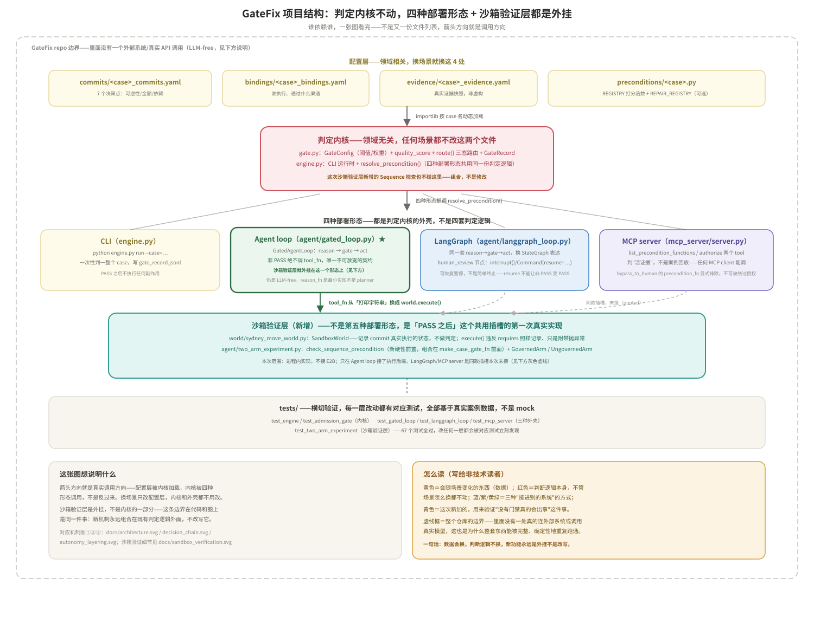
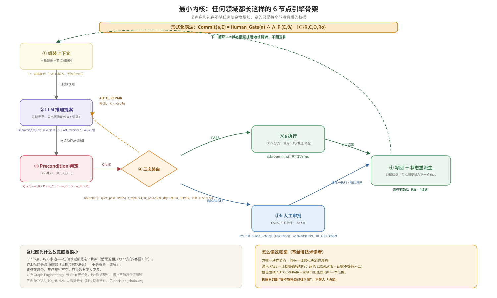
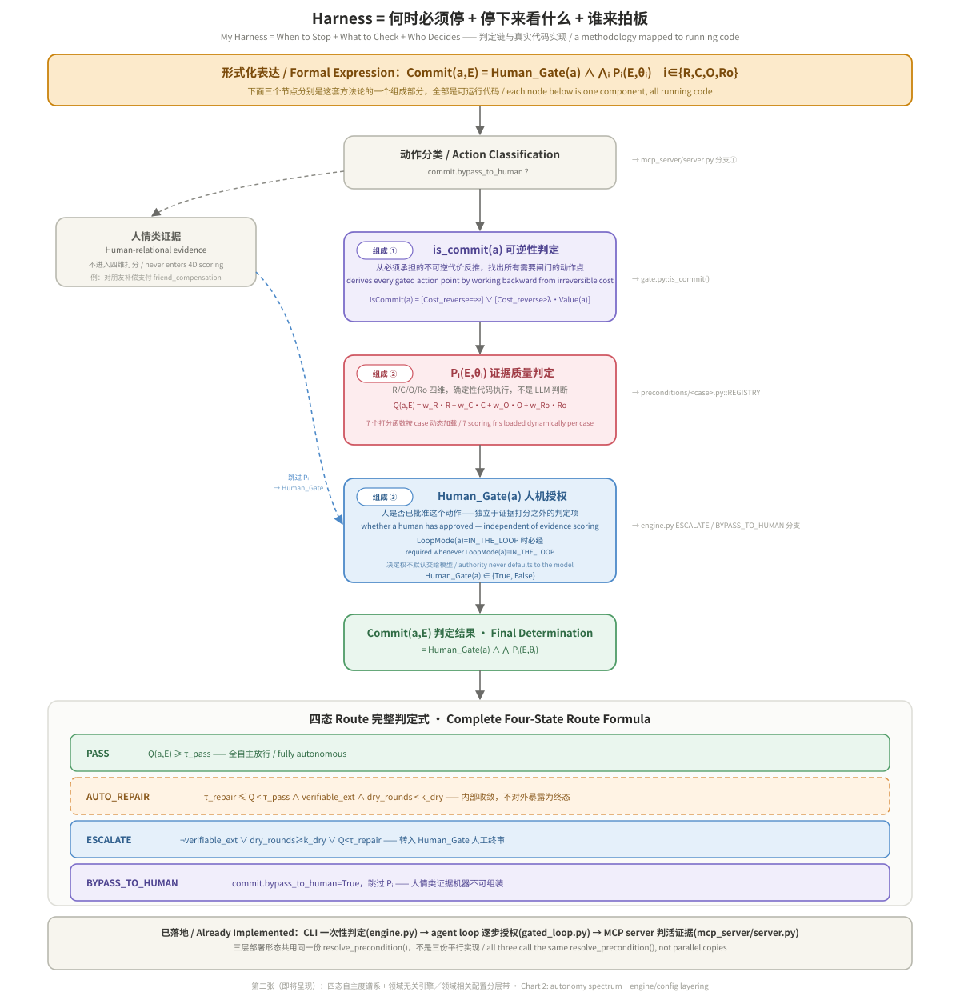
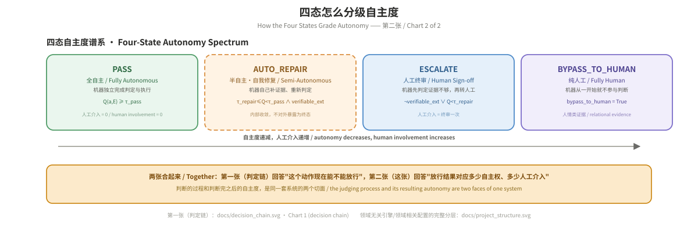
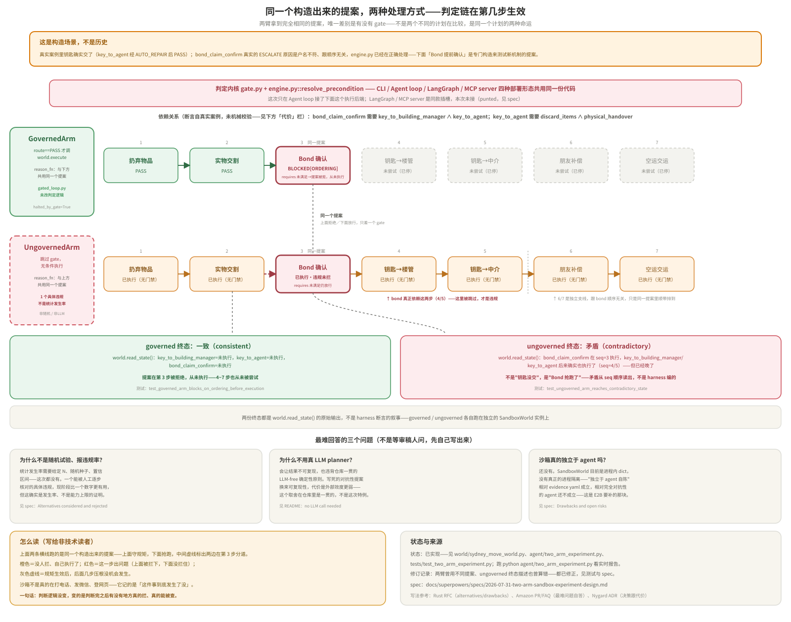

# GateFix: Agent Guardrails Forged by a Real Case

[简体中文](README.md) ｜ **English**

[](https://github.com/Sherry-py/gatefix-engine/actions/workflows/ci.yml)
[](LICENSE)

> **License:** This repository is dual-licensed under **AGPL-3.0 + a commercial license**. You are entirely free to read, run, and fork it for research or evaluation, under [AGPL-3.0](LICENSE); if you want to integrate it into a closed-source product without taking on AGPL's obligation to contribute back, obtain an exemption through the [commercial license](DUAL-LICENSE.md). See [DUAL-LICENSE.md](DUAL-LICENSE.md) for details.

> **One-line anchor:** The model is responsible for *knowing*; GateFix is responsible for *whether to let it through* — diagnosing a problem doesn't mean anything stops. That dividing line does.

```
$ python engine.py run --case=sydney_move

--- Commit: 扔弃物品 (discard_items) ---
  R=1.00 C=1.00 O=1.00 Ro=1.00 → Q=1.000  route=PASS

--- Commit: Bond claim 确认 (bond_claim_confirm) ---
  R=0.15 C=1.00 O=1.00 Ro=1.00 → Q=0.787  route=ESCALATE
  说明: 退款账户户名='第三方' ≠ 委托人姓名 —— 需人工核实关系
  → 升级给人：中介 → RBO 平台 终审
```

Under one and the same evidence-scoring rule, 5 of the 7 real decision points passed straight through, 1 passed after automatically filling an evidence gap, and 1 escalated to a human because a single detail — who the money ultimately goes to — didn't line up. It wasn't that the model's judgment fell short; it was the dividing line doing its job.

**TL;DR (English):** GateFix is a deterministic authorization layer for
agent execution — the layer between "the model decided" and "the action
happened." This project distills that judgment rule from a real,
high-stakes business process — not from a need to govern AI agents. The
rule answers: when a human and a machine collaborate on an irreversible
process, who should be allowed to proceed, and when? It shouldn't be
decided by "is there a confirm button" — it should be decided by whether
the action is *reversible*, whether the evidence covers four quality
dimensions (Relevance / Coverage / Ordering / Robustness), and what
residual external risk survives even after approval. The same rule applies
directly to AI agent pre-action authorization, since "an agent proposes an
action, the system decides whether to allow it" is structurally identical
to "a person executes one step, and needs to know whether to stop." This
repo is a small, runnable engine (`gate.py` + `engine.py`, ~250 lines, one
dependency) that encodes that decision rule and runs it end-to-end on the
real case it came from: a 7-commit, cross-border, remote lease-termination
in Sydney, with real third-party executors (names replaced with role
labels) and a real decision structure (this repo is public on GitHub, so
exact dollar amounts and the precise location are generalized — see "Case
notes" at the end). `python engine.py run
--case=sydney_move` reproduces all 7 routing decisions deterministically —
no LLM call needed, the decision logic itself is the point.

**A note for non-technical readers:** This judgment rule didn't start from a need to "add governance to AI agents." It was distilled from a real, high-stakes business process: when a human and a machine collaborate to carry out an irreversible process, who should be allowed to keep going, and when? The answer shouldn't be "is there a confirmation button?" It should be whether the action (1) can be undone, (2) has enough evidence behind it, and (3) still leaves residual external risk that can't be shaken off even after approval. The same rule applies directly to pre-action authorization for AI agents, because "an agent proposes an action and the system decides whether to let it through" and "a person executes one step and has to decide whether to stop first" are structurally the same problem. The case was a real remote lease termination of a Sydney apartment: the client had already returned home, and the keys, furniture, cleaning, and agent settlement all had to be completed remotely through 7 irreversible decision points and multiple human executors. Run the code once and you can watch the framework classify those 7 decision points into four outcomes — "let it through directly," "gather more evidence and re-judge," "a human must give final sign-off," and "a machine can't decide this one, hand it straight to a person" — all of which correspond to things that actually happened, none of them invented.

This is not an abstract demo. Every entry in `evidence/sydney_move_evidence.yaml` is something that actually happened during this remote lease termination of a Sydney apartment — including the air-freight box reinforcement decision and the tariff uncertainty added late in the case. The code runs against a real structure of facts, not a fictional case. Third-party names (agents, building managers, freight forwarders, and so on) have been replaced with role labels, and the specific location and amounts have been generalized (GitHub is a public repo, so it doesn't expose a precise location or real financial figures that could identify an individual); the structural facts — decision paths, evidence gaps, routing outcomes — are preserved as they really were.

**Being honest about where this came from:** This methodology wasn't built by making an AI agent first and then figuring out how to control it, nor was it designed to match an industry framework diagram. It was forced out by this real lease-termination case. Several of its 7 decision points were unrecoverable once done wrong (once the keys change hands, once the boxes are handed to customs-controlled freight, there's no taking it back), and at the time the only way to move forward safely was to pin down for each step exactly what evidence was sufficient and what wasn't — and only then proceed to the next step. That judgment discipline predates the terms "Agent Harness" and "Guardrails"; GateFix simply plugs a discipline that had already been proven under real pressure into a naming system the industry only recently acquired. AI agent governance is one case it naturally covers, not its starting point: wherever the question "who executes the next step" exists — a person, a script, or an agent — the judgment logic cares about the same thing: whether the evidence is good enough to permit it.

## How to run

```bash
pip install pyyaml   # 唯一外部依赖
python engine.py run --case=sydney_move
python engine.py run --case=sydney_move --verbose   # 打印每一轮 AUTO_REPAIR 的细节
```

Once it finishes, you'll see the routing process for all 7 commits line by line in the terminal, and it writes a structured judgment record to `gate_record.jsonl` (one JSON object per line, with fields such as R/C/O/Ro/Q/route/notes, ready to feed straight into downstream analysis or visualization).

```bash
pip install pytest    # 跑测试额外需要这个
pytest -v
```

The tests cover two layers: unit tests for the six formulas in `gate.py` (threshold boundaries, k_dry exhaustion, the expectation_gate truth table), and end-to-end regression tests — run a case and assert that every commit's route matches expectations exactly. After you change a case's `commits/*.yaml` / `preconditions/*.py`, these tests tell you immediately whether you've broken a routing outcome. There are currently regression tests for three cases: `tests/test_engine.py` (sydney_move, 7 commits, the real case), `tests/test_cross_border_transfer_case.py` (cross_border_transfer, 2 commits, hypothetical scenario), and `tests/test_pharmacy_dispensing_case.py` (pharmacy_dispensing, 1 commit, judgment basis taken from a real adjudicated case — see "Reusing it for another scenario" below). Note that these two layers cover different things: the unit tests verify the engine's mathematics itself (which should hold for any scenario), whereas the regression tests verify that "one particular scenario's routing outcomes haven't been accidentally broken" — not that the engine reuses cleanly across scenarios. The latter claim is verified by the three cases sharing one `gate.py`/`engine.py` with zero scenario-specific code changes.

## Project structure



This diagram is a one-shot overview of who depends on whom across the whole repository: the config layer (4 case-specific files) is loaded dynamically by the judgment core, the judgment core is called by four deployment shapes, the sandbox verification layer hangs off the Agent loop shape alone and never touches the core, and the test suite cross-cuts every one of those layers. Each section below expands one block of this diagram — look at the diagram first to see which block you're looking for, then read the details.

## Who can use it out of the box

- **Teams adding a pre-action authorization gate to their agents but still lacking a deterministic judgment layer** — their critical actions (irreversible, involving money, involving third parties) are currently either unmanaged or fobbed off with a single "confirm button"; drop a gate in without rewriting the orchestration logic.
- **Teams that need an auditable record of agent decisions** — who approved it, on what evidence, and when, rather than a pile of chat logs (this maps to `gate_record.jsonl`).
- **Teams already using a scoring/reward function to judge whether an agent is doing well, but unsure whether the standard itself is discriminative** — can it tell "didn't do it" apart from "did it"? (See the admission self-check methodology below.)
- **Teams that want three states rather than two** — not just allow/deny, but an intermediate state of "not enough evidence, but one automatic repair is possible" (AUTO_REPAIR).

**Where it doesn't fit:** agents working entirely in a low-risk, reversible action space (pure reads, draft generation) — adding a gate is unnecessary overhead; and judgment that depends heavily on multi-turn context or session state — this system takes evidence as a one-shot input and does no context management.

## What this project demonstrates

The core claim is in the TL;DR at the top; what's demonstrated here is that it can be broken down into runnable code, not just an assertion. The code turns the judgment logic into four replaceable configs loaded dynamically by `--case` (`commits/<case>_commits.yaml` / `bindings/<case>_bindings.yaml` / `evidence/<case>_evidence.yaml` / `preconditions/<case>.py`) plus an engine containing no scenario-specific logic (`gate.py` + `engine.py`, which uses `importlib` to import scoring functions dynamically by case name) — see the "Project structure" diagram above for the full call graph.

**Being honest about the current state:** Three scenarios now run end to end — `sydney_move` (real case, human-executed, physical handover), `cross_border_transfer` (hypothetical scenario, agent-executed, data compliance), and `pharmacy_dispensing` (judgment basis taken from a real adjudicated case, human operating automated equipment, irreversible physical drug administration — see "Reusing it for another scenario" below). The "engine/config separation" described above is no longer merely an architectural design: `engine.py`/`gate.py` reuse with zero changes across three completely different domains, which is the third time this design principle has been validated. **But this does not mean "swapping scenarios requires no engine changes" is a sufficiently validated general conclusion** — it has only been validated twice more, `n=3`, and only `sydney_move` is a private real case; `pharmacy_dispensing`'s judgment basis comes from a real incident but its specific evidence fields are constructed, and `cross_border_transfer` is a purely hypothetical scenario (see "Case notes" below). The sample is still small. This went from "zero cross-scenario validation" to "two cross-scenario validations" — don't read it as more than that.

Running it once shows what several of the framework's key mechanisms actually look like on real data:

- **PASS**: all four evidence dimensions are sufficient, so execution is authorized directly (e.g. "discard items," "physical handover").
- **AUTO_REPAIR**: the evidence has a gap that can be filled by external verification, so the engine automatically repairs the evidence once and re-judges ("handing keys to the building manager" — the key count originally came from "memory," which scored Relevance low; one AUTO_REPAIR round was triggered, the source became the "building manager's email," and it passed on re-judgment).
- **ESCALATE**: the evidence gap can't be externally verified, so human final sign-off is mandatory ("Bond claim confirmation" — the RBO refund account is held by a third party, not the client; that mismatch can only be resolved by a human verifying the relationship. In `engine.py`, `verifiable_ext=False`, so it never enters AUTO_REPAIR and escalates straight to a human).
- **BYPASS_TO_HUMAN**: the evidence is interpersonal and a machine simply cannot assemble it, so it never enters the four-dimension scoring ("the profit-split promise and compensation to a friend" — how close the relationship is and what tone to take aren't in any API. In reality this was two-phased: first a promise to split the proceeds proportionally; when the old items didn't sell quickly and the split fell through, it changed to a cash-plus-goods settlement. The promise phase has objective evidence and goes through a separate `expectation_gate` pre-check, which is recorded — but the pre-check result doesn't, and can't, make the call in place of the final human compensation decision).
- **The external contingent gate, Risk_ext**: for `air_freight_dispatch` (handing the air-freight boxes to the carrier), even when route=PASS the engine still additionally reports `Risk_ext = p_inspect × Loss(a∣inspected)` (inspection probability × estimated loss if inspected; the specific numbers use representative magnitudes and don't expose real loss estimates) — this is the theoretical point this framework adds: **Commit(a,E)=True does not mean the total cost is settled**. Third-party discretionary risk such as a customs inspection doesn't drop to zero just because the gate let the action through.

## Where the boundary comes from: abductive upstream, deterministic downstream

Which actions in `commits/<case>_commits.yaml` count as commit points, and how much evidence quality each point in `preconditions/<case>.py` demands — these aren't computed by the engine. A person sets them from embodied knowledge of the business (which step is irreversible, which step involves a third party, under what conditions it counts as sufficient). This step is abductive and depends on domain judgment; in this case it takes the form of the six-step methodology in the case notes (jurisdiction grounding → inherited-liability assessment → commit backward-chaining → …, see Case notes at the end). It isn't unique — someone else might draw a somewhat different boundary — and the engine won't generate that boundary for you.

Once the boundary is set, however, the `gate.py` / `engine.py` layer is fully deterministic: the same evidence and the same thresholds produce the same R/C/O/Ro/Q/route on every run — auditable and reproducible (the end-to-end regression tests in `test_engine.py` assert exactly this determinism). Upstream, human judgment draws the boundary; downstream, code holds it. This is also where the design principle "the engine is domain-agnostic, the config is domain-specific" actually lands: what has to be redone when you change scenarios is that one upstream judgment, not the machine downstream.

## Swapping the executor: if an embodied robot did these steps, would the gate still be needed?

To state the conclusion first: yes, and what's needed is the same gate, not a newly invented one.

The 7 commit points in the sydney_move case aren't "human-only" actions — discarding items, handing over belongings, transferring keys, packing and reinforcing boxes — these are exactly the deployment scenarios embodied robots are working on now (household tidying, item sorting and carrying, packing and shipping). If robots took over these steps someday, the skeleton of the business process wouldn't change: irreversible physical actions, third parties involved, and evidence sufficient enough to continue. What changes is "who reaches out to do it at the final step," not "does this step warrant asking first."

**One layer that's easy to conflate:** the capability embodied robots validate most solidly today is *continuous* execution safety — force-control models: how much force to apply here, when to stop, whether to retract on unexpected resistance. Encoding that layer of safety into the model or controller itself is the right call; it was never something that should be split out into a discrete four-state gate governing the millisecond-level feedback of every force application. That would be the wrong level of abstraction.

The problem is one layer up. When force-control capability is wrapped inside a multi-step task orchestration — a robot is told "clear out the wardrobe and pack and ship the items to be moved," and along the way it passes several moments that are in principle irreversible (once something is thrown out as trash, once a box is handed to the freight forwarder) — **that discrete judgment (can this step be taken now?) is currently handled implicitly: by the model's confidence, or by a person watching over its shoulder.** There is no independent, auditable gate at a completely different level from "how much force should this push use." GateFix supplies exactly that gate, and at the right level:

| sydney_move commit point | Corresponding embodied-robot task shape | Who guards it today | What GateFix adds |
|---|---|---|---|
| `discard_items` | Household item sorting: identifying what to discard and what to keep | Nothing / a human notices the mistake after the fact | Four-dimension evidence judgment before discarding |
| `key_to_building_manager` / `key_to_agent` (key handover) | Handing a physical credential or access right to a third party | The robot's own confidence | Explicitly judge whether the evidence is sufficient before handover; AUTO_REPAIR if not |
| `air_freight_dispatch` (box shipping) | Packing, reinforcement, handover to a freight forwarder | The model decides for itself that "packing is done" | Pre-commit authorization + `Risk_ext` reporting the risk that survives shipment |
| `bond_claim_confirm` (refund account verification) | Not applicable — a purely administrative judgment, not a physical action | — | Still an ESCALATE requiring human final sign-off; a robot shouldn't and can't make this call |

What this table is meant to show: the judgment engine (`gate.py`/`engine.py`) never knew and never needs to know whether the executor is a human, a script, or a robot — `bindings/<case>_bindings.yaml` binds "who executes this step," and that isn't an input to the judgment logic. This is also why the design principle already validated above in "What this project demonstrates" — "the engine is domain-agnostic, the config is domain-specific" — naturally covers "swapping out the executing agent," with no need to change the judgment core for a robot executor specifically.

**Being honest about the boundary:** This doesn't mean GateFix can be plugged straight into a real robot system today — `world/sydney_move_world.py` is an in-process simulation, not an execution backend for a real arm or mobile base; and if the force-control model's continuous safety layer isn't sound to begin with, GateFix's discrete authorization gate can't rescue it (the gate governs "whether to do it," not "whether it's done steadily"). What this table says is that the judgment logic applies conceptually to embodied executors, not that a real robot pipeline has been run end to end.

## What this is not

### Not competing with orchestration frameworks (LangGraph / CrewAI / Relevance AI / Coze and the like)

LangGraph orchestrates state with a graph structure, CrewAI divides work among role-based crews, and no-code platforms like Relevance AI / Coze wrap orchestration in a drag-and-drop interface — all of these live in the "orchestration/tools" layer of an agent harness, handling how an agent thinks, how it calls tools, and how it collaborates. GateFix does none of that and isn't trying to compete with them: it is the **Guardrails** layer of a harness — the judgment of "does the orchestration get to proceed when it reaches a critical action" — and by design it plugs into someone else's orchestration loop rather than building another one. Verified integration paths: an MCP tool (any MCP-compatible client) and a LangGraph StateGraph node (see "Three code-level integration paths" below).

Real products already in this space: **Alter** (an SDK that wraps every tool call in a parameter-level guardrail) and **Aport** (open source; a framework pre-action hook plus a portable agent passport) — all different implementations of "insert an independent judgment between reasoning and actual execution." GateFix's differentiation: its criteria are an explainable, deterministic 4D-CQ score rather than simple parameter validation, and its routing spans all four states (PASS/AUTO_REPAIR/ESCALATE/BYPASS_TO_HUMAN) rather than a binary allow/deny.

**Being honest about the boundary:** What can be reused directly is the judgment engine and the integration paths (`gate.py`/`engine.py`, domain-agnostic); **the criteria themselves** (the scoring functions in `preconditions/<case>.py`) have to be rewritten to match each business. It isn't a black box you can point at any business, but a methodology for turning domain knowledge into decidable rules, plus a judgment engine you don't have to rewrite.

### Relationship to DeepSeek Harness and similar projects

**Update (2026-08-14): DeepSeek Harness was open-sourced on 2026-08-13 (v0.1 developer preview, MIT, Cordis plugin architecture), so the premise of the paragraph below no longer holds — there is now a real, runnable, test-covered integration; see `dsh_plugin/`.**

What it does and how far it can be verified, stated honestly: `dsh_plugin/` is a Cordis `tools/pre-execute` hook plugin (corresponding to the "permission-gate" pattern in DeepSeek Harness's official cookbook document `docs/cookbook/extension-cookbook.md`). It intercepts the real `tools/pre-execute` waterfall, forwards the tool call's parameters to this repository's `mcp_server/authorize_stdin.py` as evidence (reusing the same `authorize()` function that `mcp_server/server.py` uses for MCP client calls — the same 4D-CQ judgment, the same audit write), and then maps `PASS/ESCALATE/BYPASS_TO_HUMAN` back onto DeepSeek Harness's own `PreToolDecision` (`allow`/`ask`/`ask`, where `ask` genuinely routes to `ctx.approval` for human approval rather than being decorative). 12 tests (`dsh_plugin/test/`) cover the pure mapping logic, a real subprocess call, and a complete dispatch of `tools/pre-execute` on a genuinely constructed Cordis `Context` across three real judgment paths (PASS/ESCALATE/fail-closed when the bridge fails) — not mocked fake passes.

Also stated honestly as a boundary: by default it maps only the two commits of the single case `cross_border_transfer` (the only case where an "agent executes" rather than "a person executes," which naturally has a tool-call shape); evidence is currently the raw tool parameters passed straight through to the judgment function, so field names have to match the names the scoring function in `preconditions/<case>.py` expects — there is no renaming or derivation layer yet; and it has never been run end to end inside a genuinely running `dsh` agent session (the tests verify down to the level of "real Cordis Context + real subprocess + real judgment result," but not to "hooked up to a real model and a real agent loop"). The full list of boundaries is in `dsh_plugin/README.md`, under "What this does not do yet."

The machine-decidable contract GateFix exposes (`{gate_state, schema_version, cq_scores, reason_code, auto_repair_available, human_readable}`, see `gate.py::build_gate_contract`) remains a protocol-agnostic, general-purpose shape; `dsh_plugin/` simply wires that contract up to its first real downstream protocol.

### Not a benchmark, and not an LLM judge — so what is it?

In one sentence: **a pre-action risk-control layer for AI agents** — it governs "can this step happen now," not "was this output good." Technical analogy: Kubernetes' admission controller — a resource change passes a policy check before it actually takes effect; if it complies, it's admitted, and if it doesn't, it's rejected or sent back for revision. GateFix does the same thing, except "resource change" is replaced by an agent action in the physical world (a transfer, a handover, a shipment, …). Non-technical analogy: it's like adding a finance approval step for AI — before reimbursing or disbursing funds, finance looks not at "is this person dependable" but at "is the paperwork for this transaction complete, and in the right order?" If it's sufficient, the payment is released; if not, it's sent back for more documentation; anything that can't be explained goes to a human.

It's clearer when compared against two neighboring but different things:

**WorkBuddy Bench** (arXiv:2607.20911v1), recently released by Tencent Youtu Lab and others, is a 260-task, multi-domain coding-agent benchmark — a neighboring but different axis from GateFix: an evaluation axis rather than an orchestration one.

- **Admission self-check**: WorkBuddy Bench requires included tasks to satisfy baseline_reward ≤ 0.3 and oracle_reward = 1.0, ensuring the grading standard itself can distinguish "didn't do it" from "did it." `tests/test_admission_gate.py` runs the same kind of self-check on the scoring function in `preconditions/sydney_move.py` — feeding it baseline evidence (the real evidence gaps) and oracle evidence (gaps filled), and asserting that the former's `route()` cannot be PASS while the latter's must be.
- **Q is orthogonal to risk magnitude**: The 4D-CQ quality score only judges whether the evidence itself is sufficient; it doesn't look at amounts or reversibility. That part is handled separately by `IsCommit`/`LoopMode`/`Risk_ext`, and the same τ_pass=0.85 applies both to a small-ticket action like "discard items" and to "air-freight box dispatch," where the amounts differ by orders of magnitude.
- **Different object of evaluation**: WorkBuddy Bench is post-hoc capability evaluation — scoring after the task finishes, measuring whether an agent can complete a whole task on its own. GateFix is in-flight risk interception — deciding whether one specific action can be released automatically before it becomes irreversible. The two can be layered within the same production system; they don't replace each other.
- **It judges "is the evidence sufficient," not "is the process correct" — and it judges with code, not with an LLM as referee**: LLM-as-judge evaluations like router/trajectory ask "did the agent pick the right tool, is the reasoning chain sound" — they evaluate the decision process itself. GateFix's 4D-CQ asks a different question: no matter how elegant the reasoning, does this specific action have enough evidence to be released right now? `bond_claim_confirm` is an example — the deduction is within the agreed range and the logic is sound, but the refund account holder's name doesn't match the client's. That isn't "the reasoning was wrong," it's "the evidence is insufficient and a human needs to verify the relationship," and an agent with flawless reasoning still gets stopped. All 7 scoring functions in `preconditions/sydney_move.py` are deterministic rule code that never calls an LLM to score — auditable, reproducible, and free of drift when the referee model is upgraded, at the cost of only being able to evaluate what was written down as rules in advance. The two aren't substitutes: router/trajectory eval is a mirror for debugging the quality of agent decisions during development, while GateFix is a gate that intercepts real consequences at runtime.

## Security boundaries

**The gating core neither needs nor accepts any credentials.** The judgment and audit logic in `gate.py`/`engine.py`/`audit.py` doesn't read, store, or require any API key, access token, or password — and this rule isn't a convention, it's verifiable: every input to the core modules' `REGISTRY`/`resolve_precondition`/`GateConfig` is case-domain data (whether a document has been processed, whether the refund account name matches, whether a box is reinforced, and so on), and no parameter accepts a credential-typed value. `tests/test_mcp_interface_discipline.py::test_importing_gate_and_engine_does_not_pull_in_llm_or_heavy_sdks` additionally guarantees that importing the core doesn't pull in any external SDK that requires credentials.

**Redacting sensitive material is the second line of defense against accidental leaks, not the first.** The first is the design constraint above: credentials simply shouldn't appear in evidence at all. If a credential-shaped string (`api_key=...`, `Bearer ...`, `sk-...` and similar patterns) does slip into a `precondition_fn`'s notes or into evidence passed by the caller, `gate.py::redact_secrets()` redacts it uniformly at two exits: the `human_readable` field of `GateResult`/`GateRecord.to_contract()`, and the `notes` field in `gate_record.jsonl` (the most recent run snapshot). The audit log (`gate_audit_log.jsonl`, see "Gate decision persistence") follows a more thorough policy — `audit.build_audit_record()` accepts no free text at all, storing only structured fields such as cq_scores/gate_state/reason_code, so there's no "store it, then redact it" step left to go wrong.

**GateFix judges the quality of evidence, not its authenticity.** `authorize(case, precondition_fn, evidence)` computes whether the `evidence` dict passed by the caller is sufficient across the four dimensions R/C/O/Ro. If the caller (or a lazy or compromised MCP client) passes `scc_signed: true` when nothing was ever signed, the gate still computes on the basis of "signed" and may still let it through. That isn't an oversight; it's this layer's responsibility boundary: evidence authenticity belongs to the **evidence-collection layer** (human verification, trusted data sources, attestation), while GateFix is the **judgment layer**, which guarantees only that "given a set of claimed evidence, the judgment logic is deterministic, reproducible, and auditable." The two responsibilities are separate, and the judgment layer shouldn't — and has no ability to — vouch for the collection layer. This boundary is an honest statement of the status quo, not a long-term plan: in v1 (today) the judgment layer stands alone and the caller is responsible for evidence authenticity; in v2, if this boundary is to be pushed forward, it would require connecting a trusted evidence source (for example, having evidence fields carry a collection timestamp or a source-system signature, with `authorize()` validating the source rather than just reading the value) — that's a question of whether and how to build an evidence-collection layer, not something this judgment engine itself needs to change.

## Mechanism diagrams



This diagram is the engine's minimal skeleton: assemble context → LLM reasoning proposal → precondition judgment → three-state routing → execution/human approval → write-back, with the corresponding formula annotated on each node. The `gate.py` / `engine.py` below are the direct code implementation of that diagram — ③ precondition judgment corresponds to the scoring functions in `preconditions/sydney_move.py`, ④ three-state routing corresponds to `GateConfig.route()` in `gate.py`, and ⑤a/⑤b correspond to the AUTO_REPAIR loop and the ESCALATE/BYPASS_TO_HUMAN branches in `engine.py`.

The next two diagrams take apart the same system from two other angles: how the decision chain actually walks through, and how it lands in engineering terms.

### The decision chain: Harness = when you must stop + what to look at when stopped + who decides



At the top is the formal expression of this methodology, `Commit(a,E) = Human_Gate(a) ∧ ⋀ᵢ Pᵢ(E,θᵢ)`; the middle decision chain runs `is_commit(a)` (back-chaining from irreversible cost to the action points that need a gate, corresponding to `gate.py::is_commit()`), then `Pᵢ(E,θᵢ)` (the 4D-CQ evidence quality judgment, corresponding to `preconditions/<case>.py::REGISTRY`), then `Human_Gate(a)` (the human-machine authorization boolean, corresponding to the ESCALATE/BYPASS_TO_HUMAN branches in `engine.py`); at the bottom is the complete four-state route formula. Each node has its corresponding code location marked to its right — this is a decision chain you can walk node by node against the real code, not a purely theoretical diagram.

### The four-state autonomy spectrum



PASS / AUTO_REPAIR / ESCALATE / BYPASS_TO_HUMAN are arranged into a spectrum of decreasing autonomy and increasing human involvement — the decision chain (the previous diagram) answers "can this action be released now," while this diagram answers "how much autonomy and how much human involvement does a given routing outcome correspond to." The layered relationship between the domain-agnostic engine and the domain-specific config isn't redrawn here; see the "Project structure" diagram at the top.

The four states are explicitly bound to "intervention strength" — they aren't four peer-level classification labels (the authoritative definition is in the `gate.py` module docstring):

- **PASS** = automatic release (the high-frequency default; the agent doesn't pause)
- **AUTO_REPAIR** = one self-healing attempt first (re-judge after filling the evidence gap; analogous to a nudge — not a release, and not a denial — and it is never an externally visible terminal state: `resolve_precondition()`/`_resolve_regular_commit()` return only once it has converged to PASS or ESCALATE)
- **ESCALATE** = requires human confirmation to continue (a block, but not a final judgment)
- **BYPASS_TO_HUMAN** = forced handoff to a human — two situations skip automatic judgment entirely: interpersonal evidence a machine cannot assemble (`friend_compensation`), or the evaluator itself being faulty rather than the evidence being insufficient (`reason_code=EVALUATOR_FAULT`, the fail-closed fallback; see "Security boundaries" above)

### The sandbox verification mechanism



This diagram isn't a component architecture diagram; it's **two real execution traces** of the same set of 7 commits. Both arms receive the **exact same proposal** — each tries, at step 3, to move `bond_claim_confirm` ahead of the two key handovers; the only difference is whether a gate is present. In the top trace there is a gate, the proposal is hard-blocked at that step, and the remaining 4 steps never get a chance to happen; in the bottom trace there is no gate, the same proposal is released directly, and all 7 steps execute. Both arms share one proposal so that the governed arm's interception can be attributed unambiguously to the new Sequence mechanism itself, rather than being mixed in with the results of other judgment branches.

**This is a constructed scenario, not history**: In the real case the keys were indeed handed over (`key_to_agent` reached PASS after AUTO_REPAIR); the real `bond_claim_confirm` ESCALATE was about the refund account name not matching, unrelated to ordering, and `engine.py` handles that correctly today — run `python engine.py run --case=sydney_move` to see it. The "confirm the bond early" proposal in the diagram never happened in reality; it was constructed specifically as an adversarial input to test the new Sequence mechanism.

The terminal states read back from `SandboxWorld.read_state()` after both traces run are one self-consistent and one self-contradictory — and the contradiction is a fact read independently out of the sandbox, not a story the diagram tells about itself. The lower half of the diagram lists three questions about the limitations of this mechanism itself (why it isn't a statistical violation rate, why it doesn't use a real LLM planner, and whether the sandbox is genuinely independent of the agent), presented alongside honest answers.

**Being honest about the boundary:** `SandboxWorld` (`world/sydney_move_world.py`) is an in-process implementation, not a sandbox that genuinely isolates the agent, and it doesn't connect to E2B; the `requires:` dependency graph is asserted from the real case with no third-party mechanical validation; the Sequence check takes effect in only one place, the Agent loop (`agent/two_arm_experiment.py`) — LangGraph and the MCP server go through the same judgment core but aren't wired to this execution backend. Run `python agent/two_arm_experiment.py` to see the two-arm comparison report; tests are in `tests/test_two_arm_experiment.py`.

The four diagrams above are, respectively, the core skeleton, the decision chain, the autonomy spectrum, and sandbox verification — see "How to run" at the top for how to run them. Below, we look at how this judgment logic actually plugs into three real deployment shapes (`python engine.py run` only "judges once"; it doesn't "plug into an agent loop").

## Three code-level integration paths

What we ran above is "judge one case once." The three paths below are ways of wiring the same gate into real agent deployment shapes — all of them call the same `resolve_precondition()`, not three separate sets of judgment logic.

### Agent loop: pre-action authorization

`agent/gated_loop.py` embeds the same gate judgment in an explicit reason → gate → act loop, demonstrating the "authorize each action before it executes" usage.

```bash
python agent/gated_loop.py --case=sydney_move
```

This command feeds the 7 commits to the real gate one by one as actions awaiting authorization, in the real order from `commits/sydney_move_commits.yaml`: the first 4 (`discard_items` / `physical_handover` / `key_to_building_manager` / `key_to_agent`) are genuinely judged PASS (`key_to_agent` really goes through one internal AUTO_REPAIR round before converging to PASS), the 5th, `bond_claim_confirm`, is genuinely judged ESCALATE, and the loop stops safely there — **`tool_fn` is never called for that step at all**, which is this module's one contract that cannot be relaxed.

A few things stated honestly:

- **No new judgment logic**: `make_case_gate_fn` in `agent/gated_loop.py` is a faithful re-implementation of the three-state routing + AUTO_REPAIR retry loop from `engine.py::run_case`, reading the same `commits/bindings/evidence/preconditions` config.
- **Still LLM-free**: `tool_fn` calls no real model or tool API (see the TL;DR at the top). The recorded cost is in abstract action-cost units, not LLM tokens — this repo can't measure token cost and doesn't pretend to.
- **`reason_fn` is a minimal implementation, not a planner**: this repo has no real reasoning or planning step; `make_case_reason_fn` simply produces the next action awaiting authorization, in the order declared by commits.yaml.
- Unit tests are in `tests/test_gated_loop.py`: some use hand-written fake gate_fn/tool_fn to test the loop's own control flow (anything non-PASS must block `tool_fn`), while others run `make_case_gate_fn("sydney_move")` directly against real case data and assert the real trace described above (AUTO_REPAIR converges, ESCALATE blocks, `tool_fn` is never called).

### Wrapping the gate as an MCP server

`mcp_server/server.py` exposes the same gate as two MCP tools, for any MCP client (Claude Desktop, other agent frameworks, …) to call. The difference from `agent/gated_loop.py` above is crucial: `make_case_gate_fn` judges **pre-recorded** sydney_move case evidence, whereas this MCP server judges **live evidence passed in by the caller on each call** — it's a gate that can genuinely stand in front of another agent's actions, not a case replay.

```bash
pip install "mcp==1.23.1"   # 只有跑 MCP server 才需要，核心仓库仍然只依赖 pyyaml
                            # 钉死版本：mcp 2.0.0 重组了包结构，去掉/挪动了
                            # mcp.server.fastmcp，不钉版本会导致 CI 装到不兼容的版本
python mcp_server/server.py   # stdio transport，接入任何 MCP client 的方式和其他 MCP server 一样
```

Two tools:

- **`list_precondition_functions(case="sydney_move")`**: lists the 7 judgeable `precondition_fn`s for this case, along with the corresponding commit name, whether it's a soft_commit, whether AUTO_REPAIR is available, and the scoring function's docstring (documenting the expected evidence fields). Call this before calling `authorize()`.
- **`authorize(case, precondition_fn, evidence)`**: performs a real judgment on the supplied `evidence`, returning `route` (`PASS`/`ESCALATE`/`BYPASS_TO_HUMAN`; `AUTO_REPAIR` has already converged internally), `authorized` (a boolean for `route == "PASS"`), `R/C/O/Ro/Q`, `verifiable_ext`, `repair_attempts`, `reason`. When `route != "PASS"`, the caller must never treat the action as authorized — exactly the same contract as `GatedAgentLoop`.

Being honest about this component's boundaries:

- **It only recognizes the evidence shape expected by sydney_move's 6 independently authorizable scoring functions**; it is not a general gate that can judge an arbitrary domain action — pass in other fields and the scoring function will only compute over the fields it recognizes; unrecognized fields are silently ignored, with no error telling you that you passed the wrong thing.
- **`bypass_to_human` commits such as `friend_compensation` don't appear in `list_precondition_functions` and can't be judged through `authorize()`** — this is intentional: even though it carries a `precondition_fn` of its own (`friend_compensation`'s `score_expectation_setting` is an internal pre-check for the promise phase, provided only as reference for human review in the CLI / agent loop / LangGraph), that pre-check result must not be treated by an external MCP client as "already authorized" and used to bypass human review — the final decision on interpersonal matters belongs directly to a human anyway.
- **Still LLM-free**: this server calls no model or external API.
- Tests are in `tests/test_mcp_server.py`: the `@mcp.tool()` decorator doesn't change the function itself (so you can call `authorize(...)` directly, without spinning up the MCP protocol or transport), and the assertions cover real AUTO_REPAIR convergence, real ESCALATE, the soft_commit branch, and the error path for an unknown `precondition_fn`.

### LangGraph StateGraph

Expressing the same reason → gate → act in LangGraph's `StateGraph`: `planner` → `gate` → `executor` (entered only when route=="PASS") / `human_review` (entered when non-PASS). The `gate` node calls `agent/gated_loop.py::resolve_precondition()` directly — the same function shared with the CLI, `GatedAgentLoop`, and the MCP server.

```bash
pip install "langgraph==1.2.10"   # 只有跑这个文件才需要，核心引擎依赖不变
python agent/langgraph_loop.py --case=sydney_move
```

The key difference from `GatedAgentLoop`: on a non-PASS result, `GatedAgentLoop` simply `return`s, whereas the `human_review` node here calls LangGraph's `interrupt()` to genuinely pause graph execution, with the outside world resuming via `Command(resume=...)` — that's the extra capability this orchestration shell has over a hand-written loop (a resumable human-in-the-loop pause, not a plain termination). Running `--case=sydney_move` genuinely triggers one interrupt at the `bond_claim_confirm` step (refund account name mismatch), prints the fields that need human judgment, simulates one human reply, and then resumes.

**The core contract is unchanged**: a human reply received on resume is only recorded into the `processed` history; it is never treated as "approval" to call `executor` — when route != PASS, `executor` is never called, exactly as with `GatedAgentLoop`. `tests/test_langgraph_loop.py` specifically tests that "even a human reply of 'approved, go ahead' doesn't turn `bond_claim_confirm` into PASS." The tests are likewise real-data end to end: the first 4 commits genuinely PASS (`key_to_agent` genuinely goes through one internal AUTO_REPAIR round), and `bond_claim_confirm` genuinely triggers an interrupt carrying the real Chinese ESCALATE reason.

## File structure

```
.
├── docs/
│   ├── project_structure.svg                 # 项目结构图：配置层/判定内核/四种部署形态/沙箱验证层/测试，谁依赖谁一次看完
│   ├── architecture.svg                      # 机制图①：六节点最小骨架 + 公式绑定
│   ├── decision_chain.svg                    # 机制图②：判定链主干 + 形式化表达 + 完整四态判定式
│   ├── autonomy_layering.svg                 # 机制图③：四态自主度谱系（引擎/配置分层见 project_structure.svg）
│   └── sandbox_verification.svg              # 机制图④：沙箱验证，同一提案两臂对比，见 world/ + agent/two_arm_experiment.py
├── docs/superpowers/specs/
│   └── 2026-07-31-two-arm-sandbox-experiment-design.md  # 沙箱验证机制的完整 spec
├── gate.py                                   # 引擎核心：GateConfig（阈值/权重）+ GateRecord（判定记录结构）
│                                              # quality_score / route / is_commit / loop_mode /
│                                              # expectation_gate / expected_external_risk 六个公式的代码实现
├── engine.py                                 # CLI 运行时：按 --case 动态加载下面四处配置→
│                                              # 打分→三态路由→(AUTO_REPAIR循环)→写回
├── world/
│   ├── __init__.py
│   └── sydney_move_world.py                  # SandboxWorld：记录 commit 真实执行的状态，不做判定
│                                              # （execute() 检查 requires，缺了照样记录、只是附带抛异常）
├── agent/
│   ├── gated_loop.py                         # reason→gate→act 循环 + resolve_precondition()
│   │                                          # （三态路由+AUTO_REPAIR+soft_commit 的共享实现，
│   │                                          # mcp_server/server.py、langgraph_loop.py 也调用它）
│   ├── langgraph_loop.py                     # 同一套编排换成 LangGraph StateGraph 表达，
│   │                                          # human_review 节点用 interrupt()/Command(resume=…)
│   └── two_arm_experiment.py                 # governed/ungoverned 两臂对比：同一个对抗性提案，
│                                              # 只切 gate 开关；组合 make_case_gate_fn，不改它
├── mcp_server/
│   └── server.py                             # 把 gate 包成 MCP server：list_precondition_functions /
│                                              # authorize 两个 tool，判定活证据，不是案例回放
├── commits/
│   ├── sydney_move_commits.yaml               # 7 个 commit 点定义（可逆性/涉及金额/打分函数名/风险配置）
│   ├── cross_border_transfer_commits.yaml     # 2 个 commit 点定义（假设场景，见下方 Case notes）
│   └── pharmacy_dispensing_commits.yaml       # 1 个 commit 点定义（判定依据取自真实已判决案件，见下方 Case notes）
├── bindings/
│   ├── sydney_move_bindings.yaml               # 每个 commit 绑定的真实执行人（以身份角色标注，姓名已脱敏）
│   ├── cross_border_transfer_bindings.yaml    # 客服 Agent → DPO/法务 的执行/终审绑定
│   └── pharmacy_dispensing_bindings.yaml      # 床边护士 → 药师/第二核对护士 的执行/终审绑定
├── preconditions/
│   ├── sydney_move.py                         # 7 个打分函数——本案例特有的 Pᵢ(E,θᵢ) 具体实现
│   ├── cross_border_transfer.py               # 2 个打分函数：一个法律判断缺口（只会 ESCALATE）、
│   │                                          # 一个事实缺口（可 AUTO_REPAIR）——跨境传输场景的 Pᵢ(E,θᵢ)
│   └── pharmacy_dispensing.py                 # 1 个打分函数——ADC override 场景的 Pᵢ(E,θᵢ) 具体实现
├── evidence/
│   ├── sydney_move_evidence.yaml              # 真实案例证据（7 条，含案例后期新增的纸箱/关税事件）
│   ├── cross_border_transfer_evidence.yaml    # 假设场景证据（2 条，法理真实、情节为构造，文件头已标注）
│   └── pharmacy_dispensing_evidence.yaml      # 代表性证据（1 条，事故真实、具体字段取值为构造，文件头已标注）
├── tests/
│   ├── test_engine.py                         # gate.py 公式单元测试 + sydney_move 端到端回归测试
│   ├── test_cross_border_transfer_case.py     # cross_border_transfer 端到端回归测试
│   ├── test_pharmacy_dispensing_case.py       # pharmacy_dispensing 端到端回归测试
│   ├── test_admission_gate.py                 # precondition 打分函数的准入自检（见上文"不是 benchmark，也不是 LLM judge"）
│   ├── test_gated_loop.py                     # agent loop 控制流单测 + 真实 sydney_move 数据的端到端断言
│   ├── test_mcp_server.py                     # MCP tool 的活证据判定测试（真实 AUTO_REPAIR/ESCALATE/soft_commit）
│   ├── test_langgraph_loop.py                  # StateGraph 真实数据端到端：interrupt/resume 不会让非 PASS 变 PASS
│   └── test_two_arm_experiment.py             # SandboxWorld + 两臂对比：governed 一致 / ungoverned 矛盾，同一提案
└── gate_record.jsonl                          # 运行后生成的判定记录（可重复生成，已提交一份跑过的样例）
```

## Reusing it in another scenario (validated with two follow-on scenarios; still a small sample)

Adding a new scenario `<new_case>` requires four new files: `commits/<new_case>_commits.yaml`, `bindings/<new_case>_bindings.yaml`, `evidence/<new_case>_evidence.yaml`, and `preconditions/<new_case>.py` (exporting `REGISTRY`; `REPAIR_REGISTRY` is optional), then `python engine.py run --case=<new_case>`. `engine.py` uses `importlib` to load those four places dynamically by case name, with no need to change a single line in `engine.py`.

`cross_border_transfer` is the second scenario added following this process. Apart from sharing `gate.py`/`engine.py` with `sydney_move`, it has no code coupling to it, and it's a completely different domain — `sydney_move` is a human-executed physical handover process, while `cross_border_transfer` is an agent-initiated data compliance decision. Its two commits correspond to two different kinds of evidence gap:

- `send_pii_to_risk_control_vendor`: EU user personal data sent to a third-country risk-control service, where the destination is not an adequacy-decision country, SCC/TIA/user consent are missing, and government-access risk hasn't been assessed → `Q=0.237 < tau_repair` → straight to `ESCALATE` for DPO/legal final review, with no AUTO_REPAIR — in this particular case the judgment basis is a legal determination, not a factual gap that can be automatically verified and filled; `verifiable_ext=False` in `preconditions/cross_border_transfer.py` means exactly that.
- `send_pii_to_ticket_archival_vendor`: the same class of transfer, but the SCC is signed and the TIA assessment itself is complete; the only gap is that the TIA document hasn't been synced into this evidence pipeline yet — a factual gap that can be externally verified and filled (`verifiable_ext=True`), so `Q=0.800` falls in the `[tau_repair, tau_pass)` interval → `AUTO_REPAIR` checks the document system once, finds it, and `Q=1.000` → `PASS`.

Running both commits within the same scenario means PASS / AUTO_REPAIR / ESCALATE all three states play out inside the flagship scenario itself, with no need to stitch scenarios together.

`pharmacy_dispensing` is the third scenario, and the first executed in the physical world that actually produced an irreversible harmful outcome — its judgment basis is taken from a real, publicly adjudicated medical incident (the 2017 Vanderbilt University Medical Center ADC override medication-error case; see Case notes below). The domain is an irreversible medication-administration action carried out by a human operating automated equipment, again with zero code coupling to the first two (a nurse used the automated dispensing cabinet's override to obtain a high-alert drug that didn't match the order, and both independent safety layers — mandatory high-alert-drug confirmation and patient identity verification — were missing, with order verification also not completed before the override → `Q=0.25 < tau_repair` → straight to `ESCALATE` for pharmacist / second-check nurse final review, again without AUTO_REPAIR — whether a drug's identity matches the current order is a judgment that has to be verified at the clinical site, not a factual gap that can be automatically verified and filled). How to run:

```bash
python engine.py run --case=cross_border_transfer
python engine.py run --case=pharmacy_dispensing
```

**Being honest about the scope of this validation:** This demonstrates that the architectural claim "the engine is domain-agnostic, the config is domain-specific" holds across three concrete scenarios; it is not a general reusability conclusion validated by a large sample. `n=3`, and only one of them (`sydney_move`) is a private real case; `pharmacy_dispensing`'s judgment basis comes from a real incident but its specific evidence fields are constructed, and `cross_border_transfer` is a purely hypothetical scenario (see Case notes below). As more scenarios are added, this claim will be further validated or refuted; for now it can only be said to "hold in all three cases so far."

## Case notes

`commits.yaml` / `bindings.yaml` / `evidence/sydney_move_evidence.yaml` are
transcribed from personal case notes on the Sydney lease termination, written
up through a six-step methodology (jurisdiction grounding → inherited-
liability assessment → commit backward-chaining → executor binding → cheap
reversible probing → evidence-package gating → custody chain → settlement
audit). Those notes are private working material, not a publication.

This repo is public on GitHub. Third-party names are replaced with role
labels, the location is kept at city level (Sydney, no suburb), and every
dollar amount is a `low`/`mid`/`high` magnitude tier (`engine.py::VALUE_TIER_SCALE`)
or a round representative number — decision structure, routing outcomes, and
evidence gaps are the real thing; only the numbers and precise location are
generalized.

`cross_border_transfer` is a different kind of case and is labeled as such
everywhere it appears (module docstrings, evidence file header, this section):
it is **not** transcribed from a real personal case the way `sydney_move` is.
The legal basis and cost are real — TikTok was fined €530M by the Irish DPC in
2025 for EU→China transfers, and GDPR Chapter V's cross-border transfer rules
are current law. The specific scenario (an EEA user's support-desk appeal
triggering a support agent's attempt to send their personal data to a
mainland-China risk-control vendor) is a plausible reconstruction grounded in
that ruling's legal logic, built to give the engine/config-separation claim
above its first test outside `sydney_move`'s domain — it does not correspond
to any real company's actual internal system, any real user, or any real
vendor. `sydney_move` remains the only case in this repo backed by a real
personal record.

`pharmacy_dispensing` is a third kind of case, also labeled as such everywhere
it appears (module/commits-file docstrings, evidence file header, this
section): its judgment basis is taken directly from a real, publicly
adjudicated incident, not a private record and not a constructed-but-plausible
scenario. On 2017-12-26 at Vanderbilt University Medical Center, nurse
RaDonda Vaught used an automated dispensing cabinet's (ADC) override function
to retrieve the wrong drug for patient Charlene Murphey: the ordered sedative
Versed (generic name midazolam) wasn't indexed under its brand name and the
first cabinet search failed, so Vaught triggered an override that opened a
much wider drug range, searched "VE" again, and this time the cabinet offered
vecuronium (a paralytic) — she withdrew and administered it, and the patient
died. On 2022-03-25 a jury convicted Vaught of criminally negligent homicide
and gross neglect; a CMS investigation found systemic issues at the hospital
(paralytics were subsequently shrink-wrapped and additional system warnings
were added). Sources: [Wikipedia, "RaDonda Vaught homicide case"](https://en.wikipedia.org/wiki/RaDonda_Vaught_homicide_case),
[KFF Health News](https://kffhealthnews.org/courts/radonda-vaught-fatal-drug-error-vanderbilt-hospital-responsibility/),
[UNC Journal of Law & Technology](https://journals.law.unc.edu/ncjolt/blogs/the-radonda-vaught-case-implications-on-health-care-and-the-law/).
The specific evidence field values in `evidence/pharmacy_dispensing_evidence.yaml`
(drug-name match, high-alert-drug confirmation, patient-ID barcode scan, order-
verified-before-override, search-string length) are a representative
construction built from this incident's reported structural facts — not a
verbatim transcription of trial records — to give the engine/config-separation
claim its third test, and its first test in a domain where the commit is a
physical, irreversible medication-administration action with a real harmful
outcome, executed by a human operating automation equipment (`sydney_move` is
human-executed physical handover with no automation in the loop;
`cross_border_transfer` is agent-initiated, with no physical action at all).
It does not correspond to any real hospital's current internal system,
config, or live patient — only the reported facts of the 2017 incident and
ISMP's subsequent published safety guidance are real.
