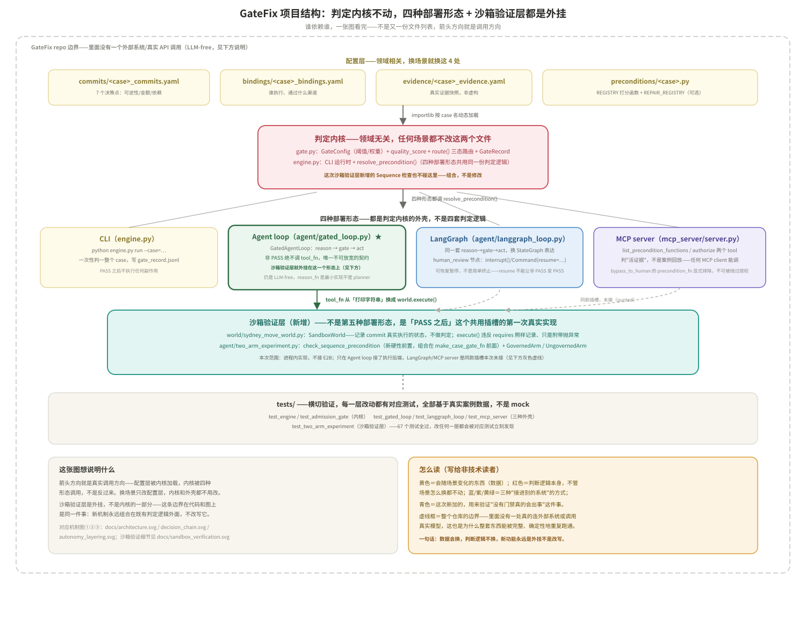
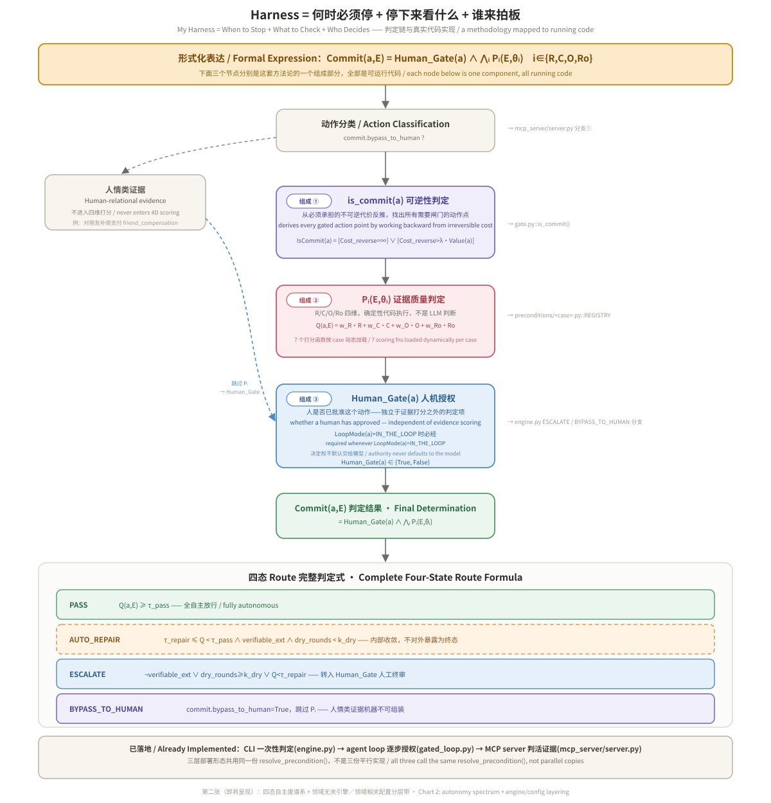
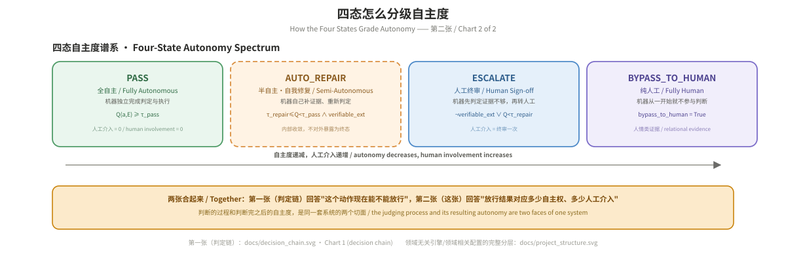
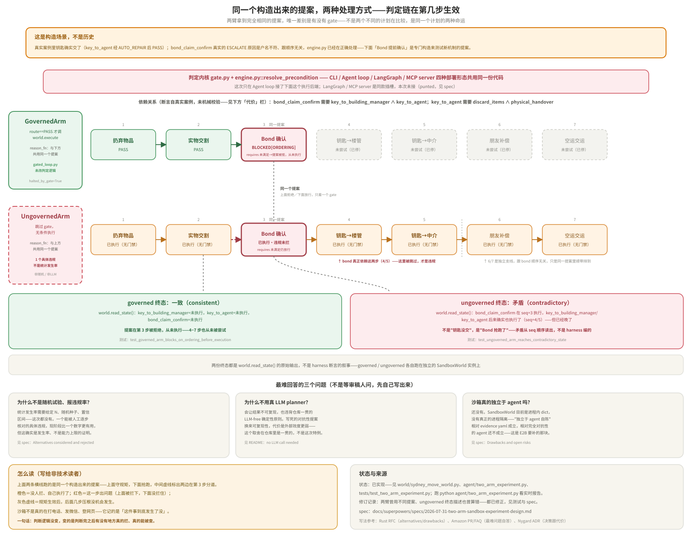

# GateFix：亲历真实案例逼出的 Agent Guardrails

[](https://github.com/Sherry-py/gatefix-engine/actions/workflows/ci.yml)

**TL;DR (English):** This project distills a judgment rule from a real,
high-stakes business process — not from a need to govern AI agents. The
rule answers: when a human and a machine collaborate on an irreversible
process, who should be allowed to proceed, and when? It shouldn't be
decided by "is there a confirm button" — it should be decided by whether
the action is *reversible*, whether the evidence covers four quality
dimensions (Relevance / Coverage / Ordering / Robustness), and what
residual external risk survives even after approval. The same rule applies
directly to AI agent pre-action authorization, since "an agent proposes an
action, the system decides whether to allow it" is structurally identical
to "a person executes one step, and needs to know whether to stop." This
repo is a small, runnable engine (`gate.py` + `engine.py`, ~250 lines, one
dependency) that encodes that decision rule and runs it end-to-end on the
real case it came from: a 7-commit, cross-border, remote lease-termination
in Sydney, with real third-party executors (names replaced with role
labels) and a real decision structure (this repo is public on GitHub, so
exact dollar amounts and the precise location are generalized — see "Case
notes" at the end). `python engine.py run
--case=sydney_move` reproduces all 7 routing decisions deterministically —
no LLM call needed, the decision logic itself is the point.

**给非技术读者的话：** 这套判定规则不是从"给 AI agent 加治理"这个需求出发的，
是从一次真实、高风险的业务流程里提炼出来的——当人和机器协作执行一个不可逆的
流程时，谁该在什么时候被允许继续往下做？答案不该是"有没有一个确认按钮"，而是
这个动作（1）能不能反悔、（2）证据够不够充分、（3）就算放行了还剩多少甩不掉的
外部风险。同一条规则直接适用于 AI agent 的执行前授权，因为"agent 提出一个
动作、系统决定放不放行"和"人执行流程里的一步、要不要先停下来"结构上是同一个
问题。案例是一次真实发生的悉尼公寓远程退租：委托人已经回国，钥匙、家具、清洁、
中介结算全部要靠 7 个不可逆决策点和多个人类执行器远程完成。代码跑一遍，
就能看到框架把这 7 个决策点分别判成"直接放行""自动补证据再判""必须叫人终审"
"这事儿机器判不了、直接交给人"四种结果——全部对应真实发生过的事，不是编的。

这不是一个抽象 demo。`evidence/sydney_move_evidence.yaml` 里的每一条都是这次悉尼
公寓远程退租真实发生过的事——包括案例后期新增的空运纸箱加固决策和关税不确定性。
代码跑的是真实事实结构，不是虚构 case。第三方（中介、楼管、货代等）的姓名已替换为
身份角色标注，具体地点和金额已泛化处理（GitHub 是公开仓库，不展示可能定位到个人的
精确地点和真实财务数字）；决策路径、证据缺口、路由结果这些结构性事实保留真实。

**如实说明出发点**：这套方法论不是先做了一个 AI agent、再想办法管它，也不是照
着行业框架图设计出来的——它是这次真实退租案例逼出来的：7 个决策点里有好几个一
旦做错就无法挽回（钥匙一旦移交、纸箱一旦交运海关就不受控），当时唯一能安全推进
的办法就是给每一步定死"什么证据够、什么证据不够"，过了才能进下一步。这套判定
纪律先于"Agent Harness""Guardrails"这些说法存在，GateFix 只是把一套已经在真实
压力下跑通的纪律，接进了行业最近才有的命名体系。AI agent 治理是它自然覆盖的一
种情况，不是起点：只要"谁在执行下一步"这个问题存在（人、脚本还是 agent），判定
逻辑关心的都是同一件事——证据够不够格放行。

## 怎么跑

```bash
pip install pyyaml   # 唯一外部依赖
python engine.py run --case=sydney_move
python engine.py run --case=sydney_move --verbose   # 打印每一轮 AUTO_REPAIR 的细节
```

跑完会在终端看到 7 个 commit 逐条的路由过程，并在 `gate_record.jsonl` 里写一份
结构化的判定记录（一行一个 JSON，含 R/C/O/Ro/Q/route/notes 等字段，可直接喂给
下一步的分析或可视化）。

```bash
pip install pytest    # 跑测试额外需要这个
pytest -v
```

测试覆盖两层：`gate.py` 六个公式的单元测试（阈值边界、k_dry 耗尽、expectation_gate
真值表），以及一个端到端回归测试——跑一遍 sydney_move case，断言 7 个 commit 的
route 结果跟本 README 里描述的完全一致。改了 `commits/sydney_move_commits.yaml` /
`preconditions/sydney_move.py` 之后这个测试能立刻告诉你有没有破坏真实案例的判定结果。
注意这两层测试覆盖的是不同的东西：单元测试验证的是引擎数学本身（对任何场景都该成立），
回归测试验证的是"sydney_move 这一个场景的判定结果没被意外改坏"——不是"多场景都能跑"，
后者目前没有测试覆盖，因为目前也只有一个场景。

## 项目结构



这张图是整个仓库"谁依赖谁"的一次性总览：配置层（4 份 `<case>` 专属文件）被判定内核动态
加载，判定内核被四种部署形态调用，沙箱验证层外挂在 Agent loop 这一个形态上、不碰内核，
测试横切验证以上每一层。下面每一节都是这张图里某一块的展开——先看图知道自己在找哪一块，
再往下看细节。

## 谁可以直接拿来用

- **正在给 agent 加执行前授权闸门、但还没有确定性判定层的团队**——关键
  动作（不可逆、涉及金额、涉及第三方）现在要么没人管，要么只有一个"确认
  按钮"糊弄过去；接一个 gate 进去，不用重写编排逻辑。
- **需要给 agent 决策留可审计记录的团队**——谁批准的、根据什么证据、什么
  时候，而不是一堆聊天日志（对应 `gate_record.jsonl`）。
- **已经在用评分/reward 函数判断 agent 做得好不好、但不确定标准本身有没
  有区分度的团队**——能不能分清"没做"和"做完"（准入自检方法论见下文）。
- **想要三态而不是二态路由的团队**——不只是允许/拒绝，还要"证据不够但能
  自动补一次"（AUTO_REPAIR）这种中间态。

**不适合的场景**：agent 完全在低风险、可逆的操作空间里工作（纯读操作、
草稿生成）——加一层 gate 是不必要的开销；判定高度依赖多轮上下文/会话状态
——这套东西证据是一次性传入的，不做上下文管理。

## 这个项目证明什么

核心主张见开头 TL;DR，这里证明的是它能被拆成可运行代码，不只是一套说法：这份
代码把判定逻辑做成了四份按 `--case` 动态加载的可替换配置
（`commits/<case>_commits.yaml` / `bindings/<case>_bindings.yaml` /
`evidence/<case>_evidence.yaml` / `preconditions/<case>.py`）+ 一个不含场景特定逻辑的引擎
（`gate.py` + `engine.py`，靠 `importlib` 按 case 名动态导入打分函数）——完整的调用关系见开头「项目结构」图。

**如实说明现状**：目前只有 `sydney_move`这一个场景跑通过。上面这套"引擎/配置分离"
是架构设计、并有 `engine.py` 里的动态加载机制作为支撑，但"换个场景不用改引擎"这句话
还没有被第二个真实场景验证过——这是设计意图，不是已经过实测的复用性结论。

跑一遍能看到框架里几个关键机制在真实数据上到底长什么样：

- **PASS**：证据四维都够，直接放行执行（如"扔弃物品""实物交割"）。
- **AUTO_REPAIR**：证据有缺口但可外部核查补齐，引擎自动去补一次证据再重新判定
  （"钥匙移交中介"这一条——钥匙数量最初来源是"记忆"，Relevance 打低分，
  触发一轮 AUTO_REPAIR 后来源换成"中介邮件"，重新判定通过）。
- **ESCALATE**：证据缺口不可外部核查，必须人工终审
  （"Bond claim 确认"——RBO 退款账户户名是第三方，不是委托人本人，
  这个不符只能靠人核实关系，engine.py 里 `verifiable_ext=False`，不会走 AUTO_REPAIR，
  直接升级给人）。
- **BYPASS_TO_HUMAN**：证据是人情类、机器根本组装不了，不进入四维打分
  （"对朋友的分账承诺与补偿"——关系深浅、开口语气不在任何 API 里。这一条现实里是两阶段：
  先承诺按比例分账，旧物短期卖不掉、分账落空后改现金+实物结清；承诺阶段有客观证据，
  单独走一次 `expectation_gate` 预检并记录在案，但预检结果不会、也不能替最终的人工补偿决定拍板）。
- **外部或有闸门 Risk_ext**：`air_freight_dispatch`（空运纸箱交运）这一条即使 route=PASS，
  引擎仍会额外报告 `Risk_ext = p_inspect × Loss(a∣inspected)`（抽查概率 × 抽查后估损，
  具体数字用代表性量级，不展示真实估损金额）——
  这是本框架这次新增的理论点：**Commit(a,E)=True 不代表总成本已确定**，
  海关抽查这类第三方裁量风险不会因为 gate 放行就清零。

## 这不是什么

### 不跟编排框架抢地盘（LangGraph / CrewAI / Relevance AI / Coze 这类）

LangGraph 用图结构编排 state，CrewAI 用角色化 crew 分工，Relevance AI /
Coze 这类无代码平台把编排包装成拖拽界面——这些做的是 agent harness 里
"编排/工具"那一层，负责 agent 怎么想、怎么调工具、怎么协作。GateFix 不做
这些，也不是要跟它们竞争：它是 harness 里的 **Guardrails** 层——"编排跑到
关键动作前，要不要放行"这一层判定，设计上就是要接进别人的编排循环，不是
自己再造一个。已验证的接入方式：MCP tool（任何支持 MCP 协议的 client）、
LangGraph StateGraph 节点（见下文"三种代码级接入方式"）。

已有的同类真实产品：**Alter**（SDK 给每次工具调用包一层参数级
guardrail）、**Aport**（开源，框架 pre-action hook + 可携带的 agent
passport）——都是"在推理和真正执行之间插一道独立判定"的不同实现。GateFix
的差异化：判定标准是可解释的 4D-CQ 确定性打分，不是简单参数校验；路由是
完整四态（PASS/AUTO_REPAIR/ESCALATE/BYPASS_TO_HUMAN），不是二元允许/拒绝。

**如实说明边界**：能直接复用的是判定引擎和接入方式（`gate.py`/`engine.py`，
领域无关），**判定标准本身**（`preconditions/<case>.py` 里的打分函数）要
跟着具体业务重写——不是换个业务就能直接用的黑箱，是"怎么把领域知识变成
可判定规则"的方法论 + 一个不用重写的判定引擎。

### 不是 benchmark，也不是 LLM judge——那它是什么

一句话：**AI agent 的执行前风控层**——管的是"这一步现在能不能发生"，不是
"这次输出好不好"。技术类比：Kubernetes 的准入控制器（admission
controller）——资源变更真正生效前先过一道策略检查，符合就放行，不符合就拒绝
或打回去改；GateFix 做的是同一件事，只是把"资源变更"换成了 agent 在现实
世界里的一个动作（转账、交接、发货……）。非技术类比：像给 AI 装了一道财务
审批——报销/放款前，财务看的不是"这个人靠不靠谱"，而是"这笔账证据全不全、
顺序对不对"，够了才放行，不够就打回去补材料，说不清的直接转人工。

跟下面两类邻近但不同的东西对比会更清楚：

腾讯 Youtu Lab 等团队近期发布的 **WorkBuddy Bench**（arXiv:2607.20911v1）是
一个 260 任务的多领域 coding-agent benchmark，和 GateFix 是另一条邻近但不同
的轴——评估维度而非编排维度：

- **准入自检**：WorkBuddy Bench 要求收录任务满足 baseline_reward ≤ 0.3、
  oracle_reward = 1.0，确保判分标准本身能区分"没做"和"做完"。
  `tests/test_admission_gate.py` 对 `preconditions/sydney_move.py` 里的打分函数
  做了同类自检——分别喂 baseline（真实证据缺口）和 oracle（补齐后）的证据，
  断言前者的 `route()` 不能是 PASS、后者必须是 PASS。
- **Q 与风险大小正交**：4D-CQ 质量分只判断证据本身够不够格，不看金额或可逆性——
  那部分由 `IsCommit`/`LoopMode`/`Risk_ext` 单独处理，同一条 τ_pass=0.85 同时
  用于"扔弃物品"这种小额动作和"空运纸箱交运"这种金额差出几个数量级的动作。
- **评估对象不同**：WorkBuddy Bench 是事后能力评估——任务跑完后打分，衡量
  agent 能不能独立完成整个任务。GateFix 是事中风险拦截——判断某个具体动作
  在变得不可逆之前能不能自动放行。二者可以在同一个生产系统里叠加，不是
  互相替代的关系。
- **判"证据够不够格"，不判"过程对不对"，且用代码判，不用 LLM 当裁判**：
  router/trajectory 这类 LLM-as-judge 评估问的是"agent 有没有选对工具、
  推理链条合不合理"——评的是决策过程本身。GateFix 的 4D-CQ 问的是不同的
  问题：不管推理多漂亮，这个具体动作现在有没有足够证据放行。
  `bond_claim_confirm` 就是个例子——扣除项在约定范围内、逻辑没错，但退款
  账户户名跟委托人不符，这不是"推理错了"，是"证据不够、需要人核实关系"，
  一个推理完美的 agent 照样会被拦下。`preconditions/sydney_move.py` 的
  7 个打分函数全是确定性规则代码，不调 LLM 打分——可审计、可复现、不随
  裁判模型改版漂移，代价是只能评提前写成规则的东西。两者不是替代关系：
  router/trajectory eval 是开发期调试 agent 决策质量的镜子，GateFix 是
  运行时拦截真实后果的闸门。

## 机制图


这张图是引擎的最小骨架：组装上下文→LLM 推理提案→Precondition 判定→三态路由→执行/人工审批→写回，
每个节点标注了对应的公式。下面的 `gate.py` / `engine.py` 就是这张图的直接代码实现——图里的
③Precondition 判定对应 `preconditions/sydney_move.py` 里的打分函数，④三态路由对应 `gate.py` 里的
`GateConfig.route()`，⑤a/⑤b 对应 `engine.py` 里 AUTO_REPAIR 循环和 ESCALATE/BYPASS_TO_HUMAN 分支。

下面两张图从另外两个角度拆开看同一套系统：判定链具体怎么走一遍，以及工程上怎么落地。

### 判定链：Harness = 何时必须停 + 停下来看什么 + 谁来拍板



顶部是这套方法论的形式化表达 `Commit(a,E) = Human_Gate(a) ∧ ⋀ᵢ Pᵢ(E,θᵢ)`；中段判定链依次是
`is_commit(a)`（从不可逆代价反推需要闸门的动作点，对应 `gate.py::is_commit()`）、`Pᵢ(E,θᵢ)`
（4D-CQ 证据质量判定，对应 `preconditions/<case>.py::REGISTRY`）、`Human_Gate(a)`（人机授权布尔量，
对应 `engine.py` 里 ESCALATE/BYPASS_TO_HUMAN 分支）；底部是完整的四态 route 判定式。每个节点右侧
都标了对应的代码位置——这是一条可以对着真实代码逐节点讲下去的判定链，不是纯理论图。

### 四态自主度谱系



把 PASS / AUTO_REPAIR / ESCALATE / BYPASS_TO_HUMAN 排成一条自主度递减、人工介入递增的谱系——
判定链（上一张图）回答"这个动作现在能不能放行"，这张图回答"放行结果对应多少自主权、多少人工
介入"。领域无关引擎和领域相关配置的分层关系不在这张图里重复画了，见开头「项目结构」图。

### 沙箱验证机制



这张图不是组件架构图，是同一组 7 个 commit 的**两条真实执行轨迹**。两臂拿到的是
**完全相同的提案**——都在第 3 步尝试把 `bond_claim_confirm` 提前到两次钥匙交接之前，
唯一差别是有没有 gate：上面一条有 gate，提案在这一步被硬性拦下，后面 4 步没有机会
发生；下面一条没有 gate，同一个提案直接放行，7 步全部执行。两臂共用同一个提案，是
为了让 governed 的拦截能明确归因于新的 Sequence 机制本身，不会和其他判定分支的结果
混在一起。

**这是构造场景，不是历史**：真实案例里钥匙确实交了（`key_to_agent` 经 AUTO_REPAIR 后
PASS），真实的 `bond_claim_confirm` ESCALATE 是退款户名不符，跟顺序无关，`engine.py`
今天就在正确处理这件事，运行 `python engine.py run --case=sydney_move` 可见。图里
"提前确认 Bond"这个提案从没在现实里发生过，是专门构造出来测试新 Sequence 机制的
对抗性输入。

两条轨迹跑完后从 `SandboxWorld.read_state()` 读回的终态，一个自洽、一个自相矛盾——
矛盾是从沙箱里独立读出来的事实，不是图自己讲的故事。图的下半部分列了三个关于这套
机制本身局限性的问题（为什么不是统计违规率、为什么不用真 LLM planner、沙箱是否真的
独立于 agent），连同诚实答案一起呈现。

**如实说明边界**：`SandboxWorld`（`world/sydney_move_world.py`）是进程内实现，不是真正对 agent 隔离的沙箱，不接 E2B；`requires:` 依赖图是从真实案例断言出来的，没有第三方机械校验；Sequence 检查只在 Agent loop（`agent/two_arm_experiment.py`）这一处生效，LangGraph / MCP server 走的是同一份判定内核，但没有接这层执行后端。跑 `python agent/two_arm_experiment.py` 能看到两臂对比报告，测试见 `tests/test_two_arm_experiment.py`。

上面四张图分别是内核骨架、判定链、自主度谱系、沙箱验证——运行方式见开头"怎么跑"。
下面看这套判定逻辑具体怎么接进三种真实部署形态（`python engine.py run` 只是"判一次"，
不是"接进 agent 循环"）。

## 三种代码级接入方式

上面跑的是"一次性判一个 case"。下面三种是把同一个 gate 接进真实 agent 部署形态的方式——
都调用同一个 `resolve_precondition()`，不是三套判定逻辑。

### Agent loop：pre-action authorization

`agent/gated_loop.py` 把同一套 gate 判定嵌进一个显式的 reason → gate → act 循环，
演示"每一步动作执行前先授权"这个用法。

```bash
python agent/gated_loop.py --case=sydney_move
```

这条命令会按 `commits/sydney_move_commits.yaml` 里的真实顺序，逐个把 7 个
commit 当作待授权的动作喂给真实 gate：前 4 个（`discard_items` /
`physical_handover` / `key_to_building_manager` / `key_to_agent`）真实判定为
PASS（`key_to_agent` 内部真实走了一轮 AUTO_REPAIR 才收敛到 PASS），第 5 个
`bond_claim_confirm` 真实判定为 ESCALATE，循环在这里安全停下——**`tool_fn`
对这一步完全没有被调用**，这是这个模块唯一不可放宽的契约。

几点如实说明：

- **没有新的判定逻辑**：`agent/gated_loop.py` 里的 `make_case_gate_fn` 是
  `engine.py::run_case` 那套三态路由 + AUTO_REPAIR 重试循环的原样复刻，读的
  是同一份 `commits/bindings/evidence/preconditions` 配置。
- **仍然是 LLM-free**：`tool_fn` 不调用任何真实模型/工具 API（见开头 TL;DR）。
  记录的 cost 是抽象 action-cost 单位，不是 LLM token——这个仓库测不了 token
  成本，不假装测。
- **`reason_fn` 是最小实现，不是 planner**：本仓库没有真正的推理/规划步骤，
  `make_case_reason_fn` 只是按 commits.yaml 声明的顺序逐个产出下一个待授权动作。
- 单元测试见 `tests/test_gated_loop.py`：一部分用手写的假 gate_fn/tool_fn 测
  循环本身的控制流（非 PASS 必须阻断 `tool_fn`），另一部分直接用
  `make_case_gate_fn("sydney_move")` 跑真实 case 数据，断言上面这条真实轨迹
  （AUTO_REPAIR 收敛、ESCALATE 阻断、`tool_fn` 未被调用）。

### 把 gate 包成 MCP server

`mcp_server/server.py` 把同一个 gate 暴露成两个 MCP tool，供任何 MCP client
（Claude Desktop、其他 agent 框架……）调用。和上面 `agent/gated_loop.py` 的
区别很关键：`make_case_gate_fn` 判的是**预录的** sydney_move 案例证据；这个
MCP server 判的是**调用方每次传入的活证据**——是一个真的能挡在别的 agent
动作前面的 gate，不是案例回放。

```bash
pip install "mcp==1.23.1"   # 只有跑 MCP server 才需要，核心仓库仍然只依赖 pyyaml
                            # 钉死版本：mcp 2.0.0 重组了包结构，去掉/挪动了
                            # mcp.server.fastmcp，不钉版本会导致 CI 装到不兼容的版本
python mcp_server/server.py   # stdio transport，接入任何 MCP client 的方式和其他 MCP server 一样
```

两个 tool：

- **`list_precondition_functions(case="sydney_move")`**：列出这个 case 里
  7 个可判定的 `precondition_fn`，附带对应 commit 名、是否 soft_commit、
  有没有 AUTO_REPAIR、以及打分函数的 docstring（说明期望的 evidence 字段）。
  调 `authorize()` 之前应该先调这个。
- **`authorize(case, precondition_fn, evidence)`**：对传入的 `evidence`
  做真实判定，返回 `route`（`PASS`/`ESCALATE`/`BYPASS_TO_HUMAN`，`AUTO_REPAIR`
  已在内部收敛）、`authorized`（`route == "PASS"` 的布尔值）、`R/C/O/Ro/Q`、
  `verifiable_ext`、`repair_attempts`、`reason`。`route != "PASS"` 时调用方
  绝不能把动作当作已授权——和 `GatedAgentLoop` 的契约完全一样。

如实说明这个东西的边界：

- **只认得 sydney_move 这 6 个可独立授权的打分函数期望的 evidence 形状**，
  不是一个能判断任意领域动作的通用 gate——传别的字段进去，打分函数只会按它
  认识的字段算，不认识的字段会被忽略，不会报错提醒你传错了。
- **`friend_compensation` 这类 `bypass_to_human` 的 commit 不会出现在
  `list_precondition_functions` 里，也没法通过 `authorize()` 判定**——这是
  有意的：即使它自己也带一个 `precondition_fn`（`friend_compensation` 的
  `score_expectation_setting` 是承诺阶段的内部预检，只给 CLI/agent
  loop/LangGraph 里的人工审核当参考），那个预检结果也不能被外部 MCP client
  当成"已授权"绕开人工审核——人情类的最终决定本来就该直接交给人。
- **仍然 LLM-free**：这个 server 不调用任何模型/外部 API。
- 测试见 `tests/test_mcp_server.py`：`@mcp.tool()` 装饰器不改变函数本身
  （直接调用 `authorize(...)` 即可，不需要起 MCP 协议/transport），断言覆盖
  真实 AUTO_REPAIR 收敛、真实 ESCALATE、soft_commit 分支、以及未知
  `precondition_fn` 的报错路径。

### LangGraph StateGraph

用 LangGraph 的 `StateGraph` 表达同一套 reason → gate → act：
`planner` → `gate` → `executor`（仅 route=="PASS" 时进入）/ `human_review`
（非 PASS 时进入）。`gate` 节点直接调用
`agent/gated_loop.py::resolve_precondition()`——和 CLI、`GatedAgentLoop`、
MCP server 共用同一个函数。

```bash
pip install "langgraph==1.2.10"   # 只有跑这个文件才需要，核心引擎依赖不变
python agent/langgraph_loop.py --case=sydney_move
```

跟 `GatedAgentLoop` 的关键区别：非 PASS 时 `GatedAgentLoop` 直接 `return`，
这里的 `human_review` 节点调用 LangGraph 的 `interrupt()` 真正暂停图执行，
外部通过 `Command(resume=...)` 恢复——这是这层编排壳比手写循环多出来的能力
（可恢复的人在环暂停，不是简单终止）。跑 `--case=sydney_move` 会在
`bond_claim_confirm`（RBO 退款账户户名不符）这一步真实触发一次 interrupt，
打印出需要人工判断的字段，模拟一次人工回复后再 resume。

**核心契约没变**：resume 收到的人工回复只会被记录进 `processed` 历史，不会
被当成"批准"去调用 `executor`——route != PASS 时 `executor` 绝不会被调用，
这一点和 `GatedAgentLoop` 完全一样，`tests/test_langgraph_loop.py` 里专门
测了"人工回复'approved, go ahead'也不会让 `bond_claim_confirm` 变成 PASS"
这一条。测试同样是真实数据端到端：前 4 个 commit 真实 PASS（`key_to_agent`
内部真实走一轮 AUTO_REPAIR），`bond_claim_confirm` 真实触发 interrupt 并携带
真实的中文 ESCALATE 理由。

## 文件结构

```
.
├── docs/
│   ├── project_structure.svg                 # 项目结构图：配置层/判定内核/四种部署形态/沙箱验证层/测试，谁依赖谁一次看完
│   ├── architecture.svg                      # 机制图①：六节点最小骨架 + 公式绑定
│   ├── decision_chain.svg                    # 机制图②：判定链主干 + 形式化表达 + 完整四态判定式
│   ├── autonomy_layering.svg                 # 机制图③：四态自主度谱系（引擎/配置分层见 project_structure.svg）
│   └── sandbox_verification.svg              # 机制图④：沙箱验证，同一提案两臂对比，见 world/ + agent/two_arm_experiment.py
├── docs/superpowers/specs/
│   └── 2026-07-31-two-arm-sandbox-experiment-design.md  # 沙箱验证机制的完整 spec
├── gate.py                                   # 引擎核心：GateConfig（阈值/权重）+ GateRecord（判定记录结构）
│                                              # quality_score / route / is_commit / loop_mode /
│                                              # expectation_gate / expected_external_risk 六个公式的代码实现
├── engine.py                                 # CLI 运行时：按 --case 动态加载下面四处配置→
│                                              # 打分→三态路由→(AUTO_REPAIR循环)→写回
├── world/
│   ├── __init__.py
│   └── sydney_move_world.py                  # SandboxWorld：记录 commit 真实执行的状态，不做判定
│                                              # （execute() 检查 requires，缺了照样记录、只是附带抛异常）
├── agent/
│   ├── gated_loop.py                         # reason→gate→act 循环 + resolve_precondition()
│   │                                          # （三态路由+AUTO_REPAIR+soft_commit 的共享实现，
│   │                                          # mcp_server/server.py、langgraph_loop.py 也调用它）
│   ├── langgraph_loop.py                     # 同一套编排换成 LangGraph StateGraph 表达，
│   │                                          # human_review 节点用 interrupt()/Command(resume=…)
│   └── two_arm_experiment.py                 # governed/ungoverned 两臂对比：同一个对抗性提案，
│                                              # 只切 gate 开关；组合 make_case_gate_fn，不改它
├── mcp_server/
│   └── server.py                             # 把 gate 包成 MCP server：list_precondition_functions /
│                                              # authorize 两个 tool，判定活证据，不是案例回放
├── commits/
│   └── sydney_move_commits.yaml               # 7 个 commit 点定义（可逆性/涉及金额/打分函数名/风险配置）
├── bindings/
│   └── sydney_move_bindings.yaml               # 每个 commit 绑定的真实执行人（以身份角色标注，姓名已脱敏）
├── preconditions/
│   └── sydney_move.py                         # 7 个打分函数——本案例特有的 Pᵢ(E,θᵢ) 具体实现
├── evidence/
│   └── sydney_move_evidence.yaml              # 真实案例证据（7 条，含案例后期新增的纸箱/关税事件）
├── tests/
│   ├── test_engine.py                         # gate.py 公式单元测试 + sydney_move 端到端回归测试
│   ├── test_admission_gate.py                 # precondition 打分函数的准入自检（见上文"不是 benchmark，也不是 LLM judge"）
│   ├── test_gated_loop.py                     # agent loop 控制流单测 + 真实 sydney_move 数据的端到端断言
│   ├── test_mcp_server.py                     # MCP tool 的活证据判定测试（真实 AUTO_REPAIR/ESCALATE/soft_commit）
│   ├── test_langgraph_loop.py                  # StateGraph 真实数据端到端：interrupt/resume 不会让非 PASS 变 PASS
│   └── test_two_arm_experiment.py             # SandboxWorld + 两臂对比：governed 一致 / ungoverned 矛盾，同一提案
└── gate_record.jsonl                          # 运行后生成的判定记录（可重复生成，已提交一份跑过的样例）
```

## 换场景怎么复用（架构设计，尚未多场景验证）

新增一个场景 `<new_case>` 需要四份新文件：`commits/<new_case>_commits.yaml`、
`bindings/<new_case>_bindings.yaml`、`evidence/<new_case>_evidence.yaml`、
`preconditions/<new_case>.py`（导出 `REGISTRY`，`REPAIR_REGISTRY` 可选），
然后 `python engine.py run --case=<new_case>`。`engine.py` 用 `importlib` 按
case 名动态加载这四处，不需要改 `engine.py` 里的任何一行。

这是"引擎领域无关、配置领域相关"这条设计原则的落地方式——描述的是架构能力，
不是已用多个场景验证过的复用性结论（现状见上文"这个项目证明什么"）。

## Case notes

`commits.yaml` / `bindings.yaml` / `evidence/sydney_move_evidence.yaml` are
transcribed from personal case notes on the Sydney lease termination, written
up through a six-step methodology (jurisdiction grounding → inherited-
liability assessment → commit backward-chaining → executor binding → cheap
reversible probing → evidence-package gating → custody chain → settlement
audit). Those notes are private working material, not a publication.

This repo is public on GitHub. Third-party names are replaced with role
labels, the location is kept at city level (Sydney, no suburb), and every
dollar amount is a `low`/`mid`/`high` magnitude tier (`engine.py::VALUE_TIER_SCALE`)
or a round representative number — decision structure, routing outcomes, and
evidence gaps are the real thing; only the numbers and precise location are
generalized.
