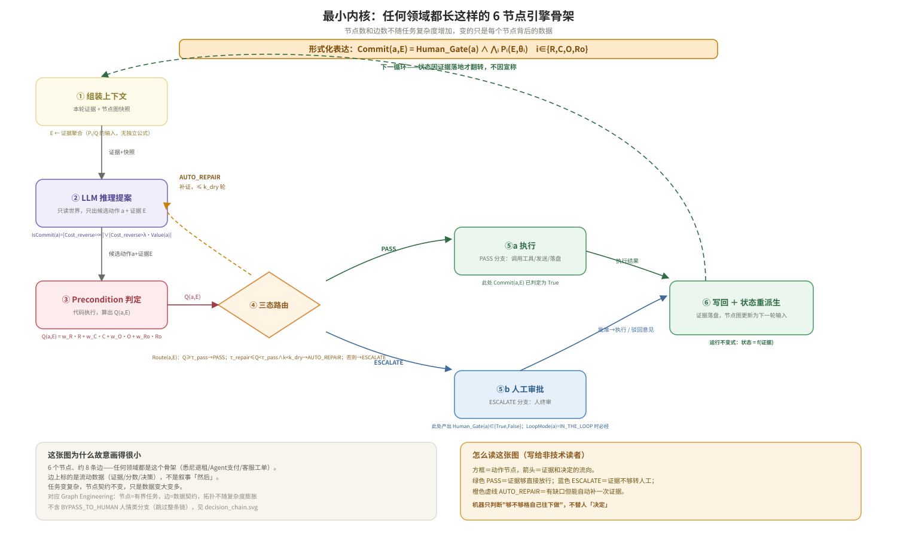

# GateFix Demo —— 悉尼远程退租案例的最小可运行实现

[](https://github.com/Sherry-py/gatefix-engine/actions/workflows/ci.yml)

**TL;DR (English):** Whether an AI agent may act on its own shouldn't be decided
by "is there a confirm button" — it should be decided by whether the action is
*reversible*, whether the evidence covers four quality dimensions (Relevance /
Coverage / Ordering / Robustness), and what residual external risk survives
even after approval. This repo is a small, runnable engine (`gate.py` +
`engine.py`, ~250 lines, one dependency) that encodes that decision rule and
runs it end-to-end on a real case: an 8-commit, cross-border, remote
lease-termination in Sydney, with real dollar amounts and real third-party
executors (names replaced with role labels, facts kept real).
`python engine.py run --case=sydney_move` reproduces all 8 routing decisions
deterministically — no LLM call needed, the decision logic itself is the
point.

**给非技术读者的话：** 这个项目回答一个问题——AI agent 什么时候能自己往下做，
什么时候必须停下来问人？答案不该是"有没有一个确认按钮"，而是这个动作
（1）能不能反悔、（2）证据够不够充分、（3）就算放行了还剩多少甩不掉的外部风险。
案例是一次真实发生的悉尼公寓远程退租：委托人已经回国，钥匙、家具、清洁、
中介结算全部要靠 8 个不可逆决策点和多个人类执行器远程完成。代码跑一遍，
就能看到框架把这 8 个决策点分别判成"直接放行""自动补证据再判""必须叫人终审"
"这事儿机器判不了、直接交给人"四种结果——全部对应真实发生过的事，不是编的。

这不是一个抽象 demo。`evidence/sydney_move_evidence.yaml` 里的每一条都是这次悉尼
Rosebery 公寓远程退租真实发生过的事——包括案例后期新增的空运纸箱加固决策和关税不确定性。
代码跑的是真实数据，不是虚构 case。第三方（中介、楼管、货代等）的姓名已替换为身份角色标注，
金额与事实细节保留真实。

## 机制图



这张图是引擎的最小骨架：组装上下文→LLM 推理提案→Precondition 判定→三态路由→执行/人工审批→写回，
每个节点标注了对应的公式。下面的 `gate.py` / `engine.py` 就是这张图的直接代码实现——图里的
③Precondition 判定对应 `preconditions/sydney_move.py` 里的打分函数，④三态路由对应 `gate.py` 里的
`GateConfig.route()`，⑤a/⑤b 对应 `engine.py` 里 AUTO_REPAIR 循环和 ESCALATE/BYPASS_TO_HUMAN 分支。

## 这个项目证明什么

GateFix 的核心主张是：agent 能不能自主执行一个动作，不该由"有没有一个确认按钮"决定，
而该由这个动作的**可逆性**、**证据是否覆盖四个维度（Relevance/Coverage/Ordering/Robustness）**、
以及**残余的外部风险**共同决定。这份代码把这套判定逻辑做成了四份按 `--case` 动态加载的
可替换配置（`commits/<case>_commits.yaml` / `bindings/<case>_bindings.yaml` /
`evidence/<case>_evidence.yaml` / `preconditions/<case>.py`）+ 一个不含场景特定逻辑的引擎
（`gate.py` + `engine.py`，靠 `importlib` 按 case 名动态导入打分函数）。

**如实说明现状**：目前只有 `sydney_move`这一个场景跑通过。上面这套"引擎/配置分离"
是架构设计、并有 `engine.py` 里的动态加载机制作为支撑，但"换个场景不用改引擎"这句话
还没有被第二个真实场景验证过——这是设计意图，不是已经过实测的复用性结论。

跑一遍能看到框架里几个关键机制在真实数据上到底长什么样：

- **PASS**：证据四维都够，直接放行执行（如"扔弃物品""实物交割"）。
- **AUTO_REPAIR**：证据有缺口但可外部核查补齐，引擎自动去补一次证据再重新判定
  （"钥匙移交中介"这一条——钥匙数量最初来源是"记忆"，Relevance 打低分，
  触发一轮 AUTO_REPAIR 后来源换成"中介邮件"，重新判定通过）。
- **ESCALATE**：证据缺口不可外部核查，必须人工终审
  （"Bond claim 确认"——RBO 退款账户户名是第三方，不是委托人本人，
  这个不符只能靠人核实关系，engine.py 里 `verifiable_ext=False`，不会走 AUTO_REPAIR，
  直接升级给人）。
- **BYPASS_TO_HUMAN**：证据是人情类、机器根本组装不了，不进入四维打分
  （"对朋友补偿支付"——关系深浅、开口语气不在任何 API 里）。
- **外部或有闸门 Risk_ext**：`air_freight_dispatch`（空运纸箱交运）这一条即使 route=PASS，
  引擎仍会额外报告 `Risk_ext = p_inspect × Loss(a∣inspected) = 0.15 × 1240 ≈ ¥186`——
  这是本框架这次新增的理论点：**Commit(a,E)=True 不代表总成本已确定**，
  海关抽查这类第三方裁量风险不会因为 gate 放行就清零。

## 怎么跑

```bash
pip install pyyaml   # 唯一外部依赖
python engine.py run --case=sydney_move
python engine.py run --case=sydney_move --verbose   # 打印每一轮 AUTO_REPAIR 的细节
```

跑完会在终端看到 8 个 commit 逐条的路由过程，并在 `gate_record.jsonl` 里写一份
结构化的判定记录（一行一个 JSON，含 R/C/O/Ro/Q/route/notes 等字段，可直接喂给
下一步的分析或可视化）。

```bash
pip install pytest    # 跑测试额外需要这个
pytest -v
```

测试覆盖两层：`gate.py` 六个公式的单元测试（阈值边界、k_dry 耗尽、expectation_gate
真值表），以及一个端到端回归测试——跑一遍 sydney_move case，断言 8 个 commit 的
route 结果跟本 README 里描述的完全一致。改了 `commits/sydney_move_commits.yaml` /
`preconditions/sydney_move.py` 之后这个测试能立刻告诉你有没有破坏真实案例的判定结果。
注意这两层测试覆盖的是不同的东西：单元测试验证的是引擎数学本身（对任何场景都该成立），
回归测试验证的是"sydney_move 这一个场景的判定结果没被意外改坏"——不是"多场景都能跑"，
后者目前没有测试覆盖，因为目前也只有一个场景。

## Agent loop 里的 pre-action authorization

上面跑的是"一次性判一个 case"。`agent/gated_loop.py` 把同一套 gate 判定嵌进一个
显式的 reason → gate → act 循环，演示"每一步动作执行前先授权"这个更贴近真实
agent 部署形态的用法——**复用的是同一个 `gate.py`/`preconditions/sydney_move.py`，
不是另一套判定逻辑**。

```bash
python agent/gated_loop.py --case=sydney_move
```

这条命令会按 `commits/sydney_move_commits.yaml` 里的真实顺序，逐个把 8 个
commit 当作待授权的动作喂给真实 gate：前 4 个（`discard_items` /
`physical_handover` / `key_to_building_manager` / `key_to_agent`）真实判定为
PASS（`key_to_agent` 内部真实走了一轮 AUTO_REPAIR 才收敛到 PASS），第 5 个
`bond_claim_confirm` 真实判定为 ESCALATE，循环在这里安全停下——**`tool_fn`
对这一步完全没有被调用**，这是这个模块唯一不可放宽的契约。

几点如实说明：

- **没有新的判定逻辑**：`agent/gated_loop.py` 里的 `make_case_gate_fn` 是
  `engine.py::run_case` 那套三态路由 + AUTO_REPAIR 重试循环的原样复刻，读的
  是同一份 `commits/bindings/evidence/preconditions` 配置。
- **仍然是 LLM-free**：`tool_fn` 不调用任何真实模型/工具 API——这个仓库设计上
  没有这样的组件（见开头 TL;DR）。它记录的 cost 是抽象 action-cost 单位，不是
  LLM token；本仓库测不了 token 成本，就不写"token 成本"这个说法。
- **`reason_fn` 是最小实现，不是 planner**：本仓库没有真正的推理/规划步骤，
  `make_case_reason_fn` 只是按 commits.yaml 声明的顺序逐个产出下一个待授权动作。
- 单元测试见 `tests/test_gated_loop.py`：一部分用手写的假 gate_fn/tool_fn 测
  循环本身的控制流（非 PASS 必须阻断 `tool_fn`），另一部分直接用
  `make_case_gate_fn("sydney_move")` 跑真实 case 数据，断言上面这条真实轨迹
  （AUTO_REPAIR 收敛、ESCALATE 阻断、`tool_fn` 未被调用）。

## 文件结构

```
.
├── docs/
│   └── architecture.svg                      # 机制图：六节点最小骨架 + 公式绑定
├── gate.py                                   # 引擎核心：GateConfig（阈值/权重）+ GateRecord（判定记录结构）
│                                              # quality_score / route / is_commit / loop_mode /
│                                              # expectation_gate / expected_external_risk 六个公式的代码实现
├── engine.py                                 # CLI 运行时：按 --case 动态加载下面四处配置→
│                                              # 打分→三态路由→(AUTO_REPAIR循环)→写回
├── agent/
│   └── gated_loop.py                         # reason→gate→act 循环：把 gate.py 嵌进 per-action
│                                              # pre-action authorization，复用真实 gate，不含新判定逻辑
├── commits/
│   └── sydney_move_commits.yaml               # 8 个 commit 点定义（可逆性/涉及金额/打分函数名/风险配置）
├── bindings/
│   └── sydney_move_bindings.yaml               # 每个 commit 绑定的真实执行人（以身份角色标注，姓名已脱敏）
├── preconditions/
│   └── sydney_move.py                         # 7 个打分函数——本案例特有的 Pᵢ(E,θᵢ) 具体实现
├── evidence/
│   └── sydney_move_evidence.yaml              # 真实案例证据（8 条，含案例后期新增的纸箱/关税事件）
├── tests/
│   ├── test_engine.py                         # gate.py 公式单元测试 + sydney_move 端到端回归测试
│   ├── test_admission_gate.py                 # precondition 打分函数的准入自检（见下方"和 benchmark 类工作的关系"）
│   └── test_gated_loop.py                     # agent loop 控制流单测 + 真实 sydney_move 数据的端到端断言
└── gate_record.jsonl                          # 运行后生成的判定记录（可重复生成，已提交一份跑过的样例）
```

## 换场景怎么复用（架构设计，尚未多场景验证）

新增一个场景 `<new_case>` 需要四份新文件：`commits/<new_case>_commits.yaml`、
`bindings/<new_case>_bindings.yaml`、`evidence/<new_case>_evidence.yaml`、
`preconditions/<new_case>.py`（导出 `REGISTRY`，`REPAIR_REGISTRY` 可选），
然后 `python engine.py run --case=<new_case>`。`engine.py` 用 `importlib` 按
case 名动态加载这四处，不需要改 `engine.py` 里的任何一行。

这是"引擎领域无关、配置领域相关"这条设计原则在代码里的落地方式，但目前
只有 `sydney_move` 一个场景跑通过——这个说法描述的是架构能力，不是一个
已经用多个场景验证过的复用性结论。

## 和 benchmark 类工作（如 WorkBuddy Bench）的关系

腾讯 Youtu Lab 等团队近期发布的 **WorkBuddy Bench**（arXiv:2607.20911v1）是一个
260 任务的多领域 coding-agent benchmark。两者不是同类工作，对比一下能说清楚
GateFix 在做什么：

- **准入自检**：WorkBuddy Bench 要求收录任务满足 baseline_reward ≤ 0.3、
  oracle_reward = 1.0，确保判分标准本身能区分"没做"和"做完"。
  `tests/test_admission_gate.py` 对 `preconditions/sydney_move.py` 里的打分函数
  做了同类自检——分别喂 baseline（真实证据缺口）和 oracle（补齐后）的证据，
  断言前者的 `route()` 不能是 PASS、后者必须是 PASS。
- **Q 与风险大小正交**：4D-CQ 质量分只判断证据本身够不够格，不看金额或可逆性——
  那部分由 `IsCommit`/`LoopMode`/`Risk_ext` 单独处理，同一条 τ_pass=0.85 同时
  用于 ¥50 的"扔弃物品"和 ¥17,100 的"空运纸箱交运"。
- **评估对象不同**：WorkBuddy Bench 是事后能力评估——任务跑完后打分，衡量
  agent 能不能独立完成整个任务。GateFix 是事中风险拦截——判断某个具体动作
  在变得不可逆之前能不能自动放行。二者可以在同一个生产系统里叠加，不是
  互相替代的关系。
- **确定性打分，而非 LLM Judge**：`preconditions/sydney_move.py` 的 7 个打分
  函数全部是确定性规则代码，为的是让判定过程可审计、可复现、不随模型改版漂移。

## Case notes

`commits.yaml` / `bindings.yaml` / `evidence/sydney_move_evidence.yaml` are
transcribed from personal case notes on the Sydney lease termination, written
up through a six-step methodology (jurisdiction grounding → inherited-
liability assessment → commit backward-chaining → executor binding → cheap
reversible probing → evidence-package gating → custody chain → settlement
audit). Those notes are private working material, not a publication.
